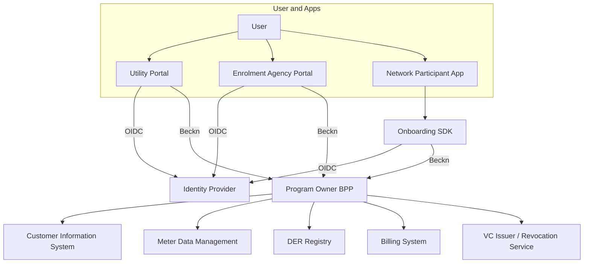
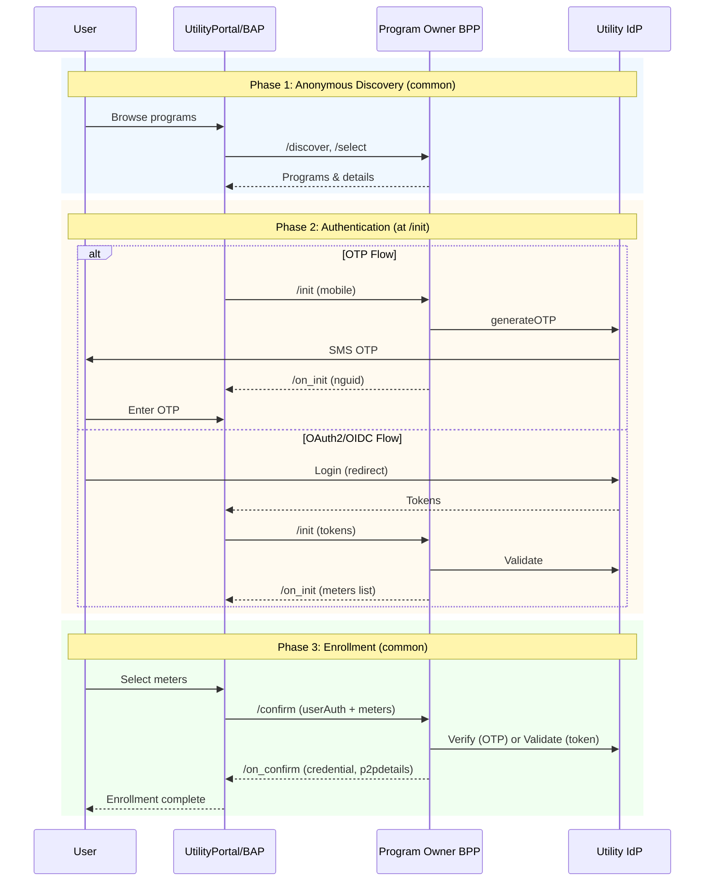
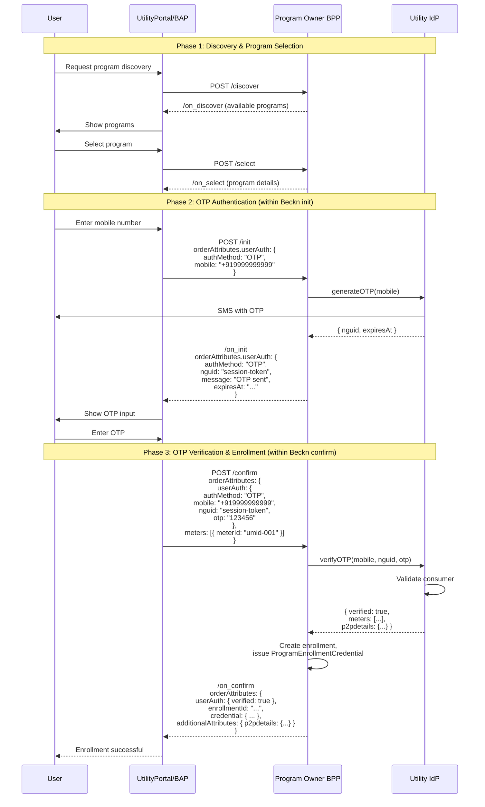
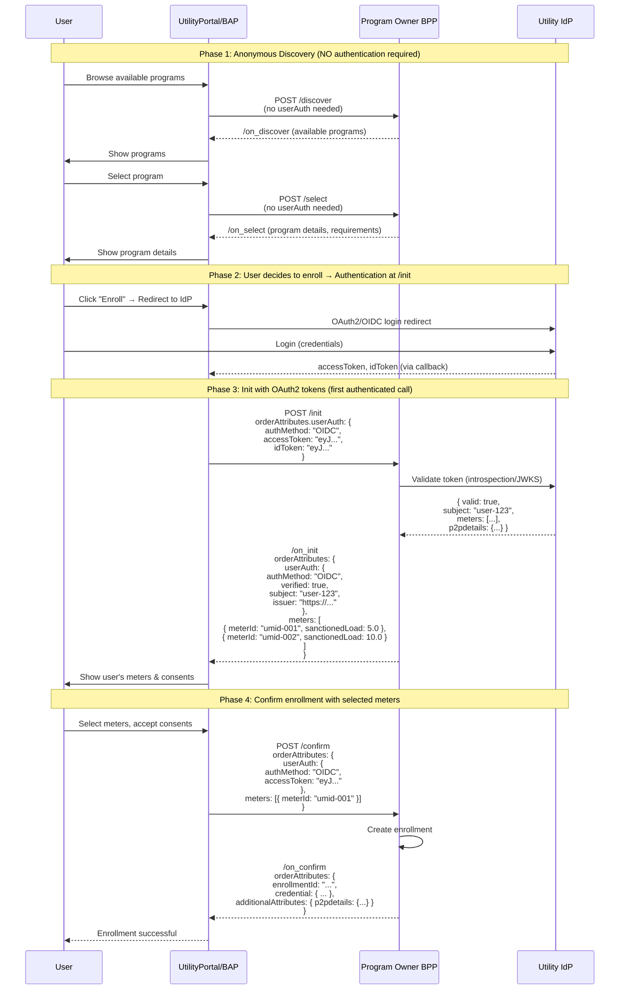
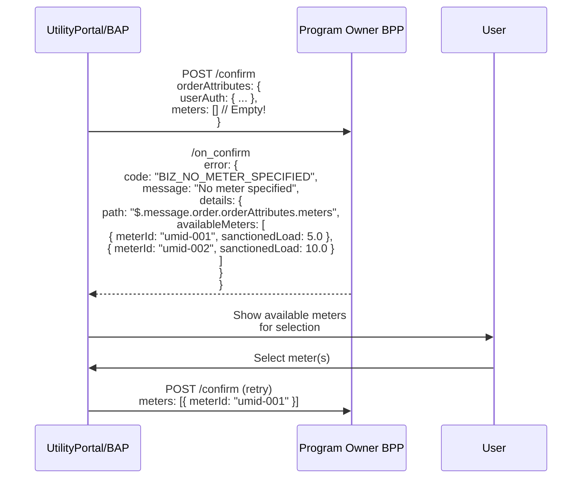
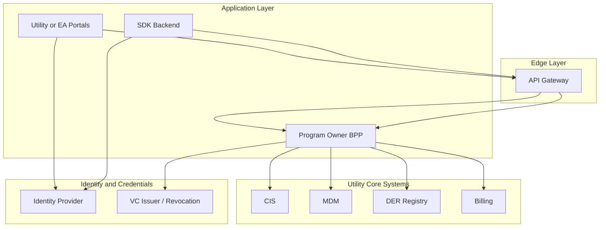
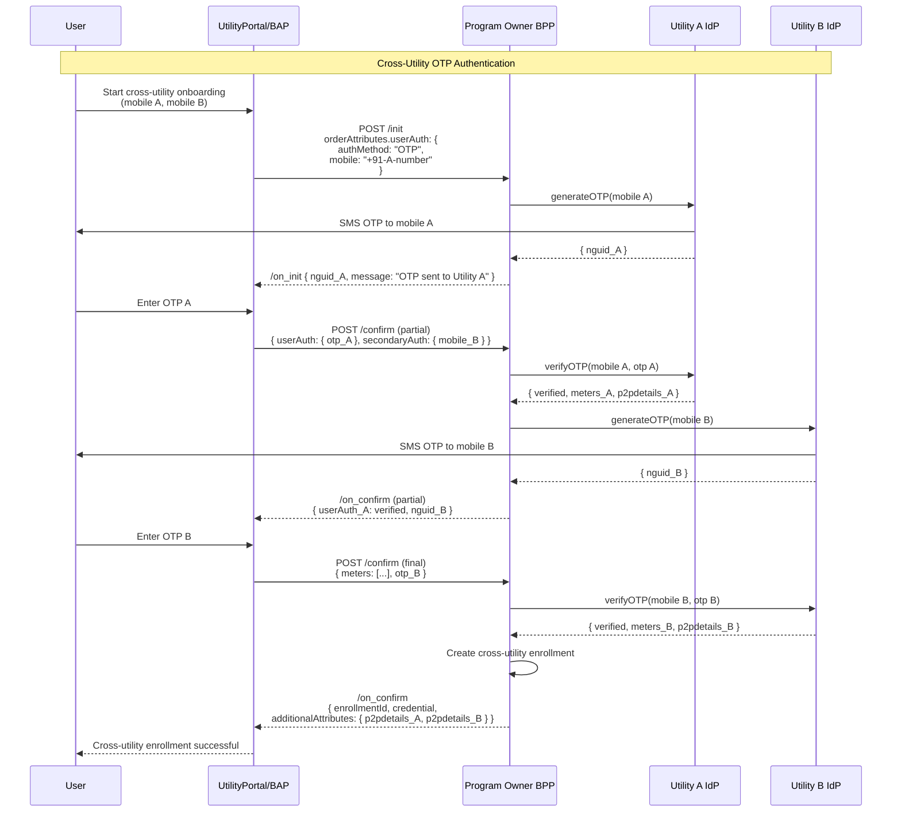

# Implementation Guide: Multi-Channel Onboarding of Users into Digital Energy Programs <!-- omit from toc -->

Version 0.2 (Non-Normative)

## Table of Contents <!-- omit from toc -->
- [1. Introduction](#1-introduction)
- [2. Scope](#2-scope)
- [3. Terminology](#3-terminology)
  - [3.1. Acronyms](#31-acronyms)
- [4. Terminology](#4-terminology)
- [5. Implementation Principles](#5-implementation-principles)
- [6. System Architecture Overview](#6-system-architecture-overview)
- [7. Identity and Authentication Implementation](#7-identity-and-authentication-implementation)
  - [7.1. Authentication Flow](#71-authentication-flow)
  - [7.2. OAuth2 Token Usage](#72-oauth2-token-usage)
  - [7.3. Utility IdP API Examples](#73-utility-idp-api-examples)
  - [7.4. MeterOwnershipCredential VC Issuance](#74-meterownershipcredential-vc-issuance)
  - [7.5. Example Utility API Implementation](#75-example-utility-api-implementation)
- [8. Asset Mapping and Data Integration](#8-asset-mapping-and-data-integration)
  - [8.1. Meter Discovery](#81-meter-discovery)
  - [8.2. DER Discovery](#82-der-discovery)
  - [8.3. Data Integration](#83-data-integration)
- [9. Beckn-Based Enrollment Implementation](#9-beckn-based-enrollment-implementation)
  - [9.1. Standard Beckn Flow](#91-standard-beckn-flow)
  - [9.2. Enrollment Flow Diagram](#92-enrollment-flow-diagram)
    - [9.2.1. High-Level Overview (Both Flows)](#921-high-level-overview-both-flows)
    - [9.2.2. OTP-Based Enrollment Flow (Detailed)](#922-otp-based-enrollment-flow-detailed)
    - [9.2.3. OAuth2/OIDC-Based Enrollment Flow (Detailed)](#923-oauth2oidc-based-enrollment-flow-detailed)
    - [9.2.4. Error Handling: No Meter Specified](#924-error-handling-no-meter-specified)
- [10. Channel-Specific Implementation Guides](#10-channel-specific-implementation-guides)
  - [10.1. Utility Portal (UtilityPortal/BAP)](#101-utility-portal-utilityportalbap)
  - [10.2. Enrolment Agency Portal (EA/BAP)](#102-enrolment-agency-portal-eabap)
  - [10.3. Network Participant App (BAP)](#103-network-participant-app-bap)
- [11. Persona-Specific Implementation Guidance](#11-persona-specific-implementation-guidance)
  - [11.1. Consumer – Single Household, Single Meter](#111-consumer--single-household-single-meter)
  - [11.2. Consumer – Multiple Households, Multiple Meters](#112-consumer--multiple-households-multiple-meters)
  - [11.3. Consumer – BTM Appliances via Home Meter](#113-consumer--btm-appliances-via-home-meter)
  - [11.4. Consumer – BTM Appliances via Same Utility (e.g., neighbor’s meter)](#114-consumer--btm-appliances-via-same-utility-eg-neighbors-meter)
  - [11.5. Consumer/Prosumer – BTM Appliances via Different Utility](#115-consumerprosumer--btm-appliances-via-different-utility)
  - [11.6. Prosumer – Single Rooftop Solar Meter](#116-prosumer--single-rooftop-solar-meter)
  - [11.7. Prosumer – Multiple Meters with Solar](#117-prosumer--multiple-meters-with-solar)
  - [11.8. Prosumer – EV with V2G](#118-prosumer--ev-with-v2g)
- [12. Governance and Operational Guidance](#12-governance-and-operational-guidance)
- [13. Data Models and Storage Considerations](#13-data-models-and-storage-considerations)
- [14. Security and Privacy Implementation](#14-security-and-privacy-implementation)
- [15. Testing, Certification and Compliance](#15-testing-certification-and-compliance)
- [16. Deployment Topology Recommendations](#16-deployment-topology-recommendations)
- [17. Developer Tooling and SDK Recommendations](#17-developer-tooling-and-sdk-recommendations)
- [18. Appendix A – Sample Payloads](#18-appendix-a--sample-payloads)
  - [18.1. Init Request](#181-init-request)
    - [18.1.1. Example: OTP-Based Init Request](#1811-example-otp-based-init-request)
    - [18.1.2. Example: OAuth2/OIDC-Based Init Request](#1812-example-oauth2oidc-based-init-request)
    - [18.1.3. Example: Simple Consumer with Single Meter](#1813-example-simple-consumer-with-single-meter)
    - [18.1.4. Example: Prosumer with Solar and Battery](#1814-example-prosumer-with-solar-and-battery)
  - [18.2. On\_Init Response](#182-on_init-response)
    - [18.2.1. Example: OTP-Based On\_Init Response](#1821-example-otp-based-on_init-response)
    - [18.2.2. Example: OAuth2/OIDC-Based On\_Init Response](#1822-example-oauth2oidc-based-on_init-response)
    - [18.2.3. Example: Successful Verification, No Conflicts](#1823-example-successful-verification-no-conflicts)
    - [18.2.4. Example: Enrollment Conflict Detected](#1824-example-enrollment-conflict-detected)
  - [18.3. Confirm Request](#183-confirm-request)
    - [18.3.1. Example: OTP-Based Confirm Request](#1831-example-otp-based-confirm-request)
    - [18.3.2. Example: OAuth2/OIDC-Based Confirm Request](#1832-example-oauth2oidc-based-confirm-request)
    - [18.3.3. Example: Confirm with Enrollment Dates](#1833-example-confirm-with-enrollment-dates)
  - [18.4. On\_Confirm Response](#184-on_confirm-response)
    - [18.4.1. Example: OTP-Based On\_Confirm Response (Success)](#1841-example-otp-based-on_confirm-response-success)
    - [18.4.2. Example: OAuth2/OIDC-Based On\_Confirm Response (Success)](#1842-example-oauth2oidc-based-on_confirm-response-success)
    - [18.4.3. Example: No Meter Specified Error](#1843-example-no-meter-specified-error)
    - [18.4.4. Example: Successful Enrollment with Credential](#1844-example-successful-enrollment-with-credential)
  - [18.5. Error Response Example](#185-error-response-example)
    - [18.5.1. Example: Credential Verification Failed](#1851-example-credential-verification-failed)
  - [18.6. Consent Revocation](#186-consent-revocation)
    - [18.6.1. Example: Consent Revocation Request](#1861-example-consent-revocation-request)
    - [18.6.2. Example: Consent Revocation Response](#1862-example-consent-revocation-response)
  - [18.7. Unenrollment](#187-unenrollment)
    - [18.7.1. Example: Unenrollment Request](#1871-example-unenrollment-request)
    - [18.7.2. Example: Unenrollment Response](#1872-example-unenrollment-response)
- [19. Appendix B – Multi-Utility Interaction Patterns](#19-appendix-b--multi-utility-interaction-patterns)
- [20. Appendix C – Error Handling Patterns](#20-appendix-c--error-handling-patterns)

Table of contents and section auto-numbering was done using [Markdown-All-In-One](https://marketplace.visualstudio.com/items?itemName=yzhang.markdown-all-in-one) vscode extension. Specifically `Markdown All in One: Create Table of Contents` and `Markdown All in One: Add/Update section numbers` commands accessible via vs code command pallete.

Example jsons were imported directly from source of truth elsewhere in this repo inline by inserting the pattern below within all json expand blocks, and running this [script](/scripts/embed_example_json.py), e.g. `python3 scripts/embed_example_json.py path_to_markdown_file.md`.

```
<details><summary><a href="/path_to_file_from_root">txt_with_json_keyword</a></summary>

</details>
``` 

---

## 1. Introduction

This Implementation Guide explains how to build and operate a multi-channel onboarding system for Digital Energy Programs such as:

* Peer-to-Peer (P2P) energy trading
* Demand flexibility or demand response
* Virtual Power Plants (VPPs)
* Community solar and other tariff or incentive programs

A successful onboarding process must confirm:

* The identity of the user
* The user’s relationship to one or more utilities
* The meters and sites associated with the user
* Any Behind-the-Meter (BTM) devices or Distributed Energy Resources (DERs)
* The user’s eligibility for a given program
* The necessary consents for data use, telemetry, or control rights

This guide provides engineering and operational recommendations to implement the multi-channel model defined in the Technical Specification.

---

## 2. Scope

This document covers:

* Engineering patterns for multi-channel onboarding
* Identity and login integration
* Meter and DER mapping
* How to use Beckn flows for onboarding
* Guidance for utility portals, Enrolment Agency portals, and SDK-based flows
* Persona-specific onboarding patterns
* Governance requirements for utilities and EAs
* Data, security, and compliance recommendations

This guide does not redefine schemas or protocol rules; those remain in the Technical Specification.

---

## 3. Terminology

Below is a consolidated terminology set used throughout this guide.

### 3.1. Acronyms

| Acronym | Full Form | Definition |
|---------|-----------|------------|
| **Utility IdP** | Utility Identity Provider | The OIDC-based identity provider operated by or on behalf of a utility. Handles user authentication (OTP, password, etc.) and issues OAuth2 tokens and Verifiable Credentials. |
| **Program Owner BPP** | Program Owner Beckn Provider Platform | The BPP implementation operated by the Program Owner (utility or energy program operator). Also referred to as UtilityBPP or Orchestrator in some contexts. Handles enrollment flows and issues Program Enrollment Credentials. |

---

## 4. Terminology

| Term                                   | Definition                                                                                                            |
| -------------------------------------- | --------------------------------------------------------------------------------------------------------------------- |
| User / End User                        | A person or organization participating in a digital energy program (consumer, prosumer, EV owner, business).          |
| Utility                                | An electricity provider responsible for metering, billing, and grid operations.                                       |
| Program Owner                          | The entity offering a digital energy program (P2P, Flex, VPP). Operates the Program Owner BPP (also called UtilityBPP/Orchestrator) for enrollment flows.                        |
| Utility IdP                            | Utility Identity Provider. OIDC-based identity provider that handles user authentication and issues OAuth2 tokens and Verifiable Credentials. |
| Program Owner BPP                      | Program Owner Beckn Provider Platform. The BPP implementation that handles enrollment flows and issues Program Enrollment Credentials. Also referred to as UtilityBPP or Orchestrator. |
| Enrolment Agency (EA)                  | A utility-certified entity authorized to onboard users, either via self-service or assisted flows.                    |
| Network Participant                    | Any Beckn-enabled application (BAP, BPP, NFO, EV app, DER app) that can trigger onboarding but is not a certified EA. |
| Network Facilitator Organization (NFO) | A neutral governance or orchestration entity in a digital energy network. Does not make eligibility decisions.        |
| National Identity                      | A government-backed identity (e.g., Social Security Number, Aadhaar, BankID, SingPass) used via federated IdPs.       |
| Utility Customer Identifier            | A unique customer or account number issued by a utility.                                                              |
| Program-Level Meter Identifier (UMID)  | A universal, utility-agnostic meter identity used across programs.                                                    |
| DER Identifier (DER-ID)                | Unique program-level identifier for a distributed energy resource.                                                    |
| Subject Identifier (subject_id)        | The unified identifier for a user across utilities, apps, and programs (often a DID or OIDC `sub`).                   |
| Meter                                  | A physical electricity meter tracking consumption, generation, or net flow.                                           |
| Behind-the-Meter (BTM) Appliance       | A device consuming or producing energy behind a user’s meter (e.g., EV charging at home).                             |
| Distributed Energy Resource (DER)      | Any distributed asset such as solar PV, EV, home batteries, V2G, or smart loads.                                      |
| EVSE                                   | Electric Vehicle Supply Equipment (charging station).                                                                 |
| Digital Energy Program                 | Any structured offering such as P2P trading, Flex, VPP, Community Solar, or special tariffs.                          |
| Program Enrollment                     | Approval for a user to join a program, issued as a Verifiable Credential.                                             |
| Eligibility Criteria                   | Conditions needed for joining a program, returned dynamically via Beckn select/init flows.                            |
| Consent                                | Authorization for data sharing, telemetry, control rights, or cross-utility interactions.                             |
| BAP (Beckn Application Platform)       | A consumer-facing Beckn application.                                                                                  |
| BPP (Beckn Provider Platform)          | A provider system responding to Beckn calls. The Program Owner serves as a BPP for onboarding.                        |
| Discover / Select / Init / Confirm     | The four core Beckn workflow steps used for onboarding.                                                               |
| Context Object                         | Beckn metadata (transaction ID, timestamp, domain, signature info).                                                   |
| Utility Portal                         | User-facing portal run by a utility for onboarding.                                                                   |
| Enrolment Agency Portal                | A certified EA’s portal for onboarding users.                                                                         |
| Onboarding SDK                         | A software kit embedded inside apps to execute standardized onboarding flows.                                         |
| Network Participant Application        | Any application embedding the onboarding SDK (EV, DER, aggregator, smart home apps).                                  |
| Program Enrollment Credential          | A Verifiable Credential proving program participation.                                                                |
| Revocation List                        | Mechanism for invalidating credentials.                                                                               |
| DER Certification                      | Proof that a DER asset (solar, EVSE, etc.) is compliant and safely installed.                                         |
| Audit Trail                            | Signed, immutable record of onboarding-related actions.                                                               |
| Authorization                          | Permission to onboard users or to control DER assets.                                                                 |
| Capability                             | Functional characteristics an entity or device supports (e.g., V2G capability).                                       |


---

## 5. Implementation Principles

1. All onboarding channels must route to the same Program Owner backend.
2. Onboarding follows a consistent order:
   identity → meters → DERs → program evaluation → enrollment.
3. Eligibility criteria must be fetched dynamically from the Program Owner.
4. All telemetry, cross-utility, and DER control actions require explicit consent.
5. Beckn discover/select/init/confirm flows should be reused without deviation.
6. User inputs should be minimized through auto-discovery where possible.

---

## 6. System Architecture Overview

A typical implementation includes:

* An Identity Provider (IdP)
* An Onboarding Orchestration Layer (portal or SDK backend)
* A Program Owner BPP (eligibility logic and enrollment credential issuer)
* Utility Core Systems (CIS, MDM, DER registry, billing)
* A credential issuance and verification subsystem

Architecture Diagram (Mermaid):



---

## 7. Identity and Authentication Implementation

The Utility IdP and Program Owner BPP work together to provide a seamless authentication and enrollment experience. Authentication can be integrated with the Beckn enrollment flow in two ways:

### 7.1. Authentication Flow

The enrollment flow supports two authentication methods, both embedded within the Beckn protocol messages.

**Important: Authentication is NOT required for /discover and /select.** Users can browse programs anonymously. Authentication is only required starting from `/init`.

**Option 1: OTP-Based Authentication (BPP-Orchestrated)**
1. User browses programs via `/discover` and `/select` (anonymous, no auth required)
2. User decides to enroll → provides mobile number to UtilityPortal/BAP
3. BAP sends `init` request with `userAuth: { authMethod: "OTP", mobile: "..." }`
4. Program Owner BPP calls Utility IdP to generate OTP
5. User receives OTP via SMS and enters it in the portal
6. BAP sends `confirm` request with `userAuth: { authMethod: "OTP", mobile, nguid, otp }` and `meters` array
7. Program Owner BPP calls Utility IdP to verify OTP and retrieve meter/p2pdetails
8. BPP creates enrollment and returns credential

**Option 2: OAuth2/OIDC Authentication (Deferred until /init)**
1. User browses programs via `/discover` and `/select` (anonymous, no auth required)
2. User decides to enroll → BAP redirects to Utility IdP for OAuth2/OIDC login
3. User authenticates with Utility IdP (receives accessToken, idToken)
4. BAP sends `init` request with `userAuth: { authMethod: "OIDC", accessToken, idToken }`
5. Program Owner BPP validates token with Utility IdP, retrieves user's meters
6. BPP returns meters list in `/on_init` response
7. User selects meters → BAP sends `confirm` request with tokens and `meters` array
8. BPP creates enrollment and returns credential

### 7.2. OAuth2 Token Usage

**IMPORTANT: OAuth2/OIDC tokens are transmitted in the Beckn message payload (`orderAttributes.userAuth`), NOT in HTTP Authorization headers.**

This design ensures:
- Authentication is part of the business flow, not transport layer
- BPP can orchestrate authentication with multiple IdPs
- Consistent handling across different authentication methods (OTP vs OAuth2)

**Example Beckn Request with OAuth2 Token in Payload:**
```http
POST /beckn/init HTTP/1.1
Host: program-owner-bpp.example.com
Content-Type: application/json
X-Gateway-Authorization: <beckn_gateway_signature>

{
  "context": {
    "domain": "beckn.one:deg:p2p-enrollment:2.0.0",
    "action": "init",
    ...
  },
  "message": {
    "order": {
      "orderAttributes": {
        "@context": ".../EnergyEnrollment/v0.2/context.jsonld",
        "@type": "EnergyEnrollment",
        "userAuth": {
          "authMethod": "OIDC",
          "accessToken": "eyJhbGciOiJSUzI1NiIsInR5cCI6IkpXVCJ9...",
          "idToken": "eyJhbGciOiJSUzI1NiIsInR5cCI6IkpXVCJ9..."
        }
      }
    }
  }
}
```

**Example OTP-Based Request:**
```json
{
  "message": {
    "order": {
      "orderAttributes": {
        "@type": "EnergyEnrollment",
        "userAuth": {
          "authMethod": "OTP",
          "mobile": "+919999999999"
        }
      }
    }
  }
}
```

**Example OAuth2 Token Payload (decoded JWT):**
```json
{
  "sub": "did:example:user-12345",
  "aud": "program-owner-bpp",
  "iss": "https://utility-idp.example.com",
  "iat": 1704067200,
  "exp": 1704070300,
  "nonce": "abc123",
  "acr": "2",
  "amr": ["otp"],
  "meterId": "umid-001",
  "caNumber": "CA123456789"
}
```

**Standard OAuth2 Token Fields:**
- `sub`: Subject identifier (user's unique ID)
- `aud`: Audience (intended recipient, e.g., Program Owner BPP)
- `iss`: Issuer (Utility IdP URL)
- `iat`: Issued at (Unix timestamp)
- `exp`: Expiration time (Unix timestamp)
- `nonce`: Random value to prevent replay attacks
- `acr`: Authentication Context Class Reference (assurance level)
- `amr`: Authentication Methods References (e.g., ["otp", "password"])

**Custom Claims (Utility-Specific):**
- `meterId`: Meter identifier (UMID)
- `caNumber`: Customer account number
- Additional utility-specific claims as needed

### 7.3. Utility IdP API Examples

The Utility IdP provides APIs for OTP generation, verification, and consumer validation. **These APIs are called by the Program Owner BPP** (not the BAP) to orchestrate authentication. This design allows:
- BPP to manage authentication flow centrally
- Support for multiple Utility IdPs in multi-utility scenarios
- Consistent authentication regardless of BAP implementation

The exact API structure may vary by utility, but the following represents common patterns:

**Generic OTP Generation Request:**
```http
POST /api/v1/otp/generate
Authorization: Bearer <api_token>
Content-Type: application/json

{
  "mobileNumber": "+1234567890",
  "requestId": "req-12345-67890"
}
```

**Generic OTP Generation Response:**
```json
{
  "status": "success",
  "requestId": "req-12345-67890",
  "otpSessionId": "session-abc123",
  "expiresIn": 300,
  "message": "OTP sent to registered mobile number"
}
```

**Generic OTP Verification Request:**
```http
POST /api/v1/otp/verify
Authorization: Bearer <api_token>
Content-Type: application/json

{
  "otpSessionId": "session-abc123",
  "otp": "123456",
  "mobileNumber": "+1234567890"
}
```

**Generic OTP Verification Response:**
```json
{
  "status": "success",
  "verified": true,
  "verifiedAt": "2024-10-15T10:35:05Z",
  "meters": [
    {
      "meterId": "umid-001",
      "caNumber": "CA123456789",
      "meterNumber": "METER987654321",
      "address": "123 Main Street",
      "sanctionedLoad": 5.0,
      "connectionType": "residential"
    },
    {
      "meterId": "umid-002",
      "caNumber": "CA123456790",
      "meterNumber": "METER987654322",
      "address": "456 Oak Avenue",
      "sanctionedLoad": 10.0,
      "connectionType": "commercial"
    }
  ],
  "p2pdetails": {
    "usertype": "prosumer",
    "isp2pactive": false,
    "iscaactive": false,
    "sdload": "5.0",
    "cuflimit": "10.0"
  },
  "meterOwnershipCredential": {
    "credentialId": "vc-meter-ownership-001",
    "type": "MeterOwnershipCredential",
    "format": "VC-JWT",
    "credentialData": "eyJhbGciOiJSUzI1NiIsInR5cCI6IkpXVCJ9..."
  }
}
```

**Note:** The `accessToken` is optional in the response. The BPP may or may not receive an OAuth2 token from the Utility IdP. The critical data returned is the `meters` array and optional `p2pdetails` (additionalAttributes) which are passed to the BAP in the `on_confirm` response.

**Generic Consumer Validation Request:**
```http
POST /api/v1/consumer/validate
Authorization: Bearer <api_token>
Content-Type: application/json

{
  "caNumber": "CA123456789",
  "mobileNumber": "+1234567890",
  "userType": "CONSUMER"
}
```

**Generic Consumer Validation Response:**
```json
{
  "status": "success",
  "consumer": {
    "caNumber": "CA123456789",
    "meterNumber": "METER987654321",
    "name": "John Doe",
    "address": "123 Main Street",
    "connectionStatus": "ACTIVE",
    "sanctionLoad": 5.0,
    "meterType": "SMART_METER"
  }
}
```

### 7.4. MeterOwnershipCredential VC Issuance

After successful OTP verification and consumer validation, the Utility IdP issues a `MeterOwnershipCredential` Verifiable Credential. This VC is then included in the Beckn `init` request's `orderAttributes.meterOwnershipCredential` field.

**Example MeterOwnershipCredential VC (decoded JWT payload):**
```json
{
  "vc": {
    "@context": ["https://www.w3.org/2018/credentials/v1"],
    "type": ["VerifiableCredential", "MeterOwnershipCredential"],
    "credentialSubject": {
      "id": "did:example:user-12345",
      "meterId": "umid-001",
      "utilityId": "utility-example-001",
      "caNumber": "CA123456789",
      "meterNumber": "METER987654321",
      "ownershipStatus": "OWNER",
      "validFrom": "2024-01-01T00:00:00Z",
      "validUntil": "2025-12-31T23:59:59Z"
    },
    "issuanceDate": "2024-10-15T10:25:00Z"
  },
  "iss": "did:example:utility-idp",
  "iat": 1704067200
}
```

This VC proves that the user (identified by `subject_id` from OAuth2 token) owns the specified meter/CA, as verified through the OTP flow with the Utility IdP.

### 7.5. Example Utility API Implementation

For reference, the following section shows an example of how a specific utility might implement these APIs. **Note:** This is for illustration only; actual utility implementations may vary.

<details>
<summary>Example Utility API Implementation (Click to expand)</summary>

**Example: Utility-Specific OTP API**

Some utilities may require field-level encryption for security. The following shows an example pattern:

**GenerateOTP Request (with encryption):**
```http
POST /api/integration/otp/generate
Content-Type: application/json

{
  "sms_id": "ENC[base64_encrypted_sms_id]",
  "mobile_no": "ENC[base64_encrypted_mobile_number]",
  "username": "ENC[base64_encrypted_username]"
}
```

**GenerateOTP Response:**
```json
{
  "message": "SUCCESS",
  "Response_code": "200",
  "sessionId": "session-12345-67890"
}
```

**VerifyOTP Request (with encryption):**
```http
POST /api/integration/otp/verify
Content-Type: application/json

{
  "sms_id": "ENC[base64_encrypted_sms_id]",
  "mobile_no": "ENC[base64_encrypted_mobile_number]",
  "username": "ENC[base64_encrypted_username]",
  "sessionId": "session-12345-67890",
  "otp": "ENC[base64_encrypted_otp]"
}
```

**ValidateConsumer Request (with encryption):**
```http
POST /api/integration/consumer/validate
Content-Type: application/json

{
  "cano": "ENC[base64_encrypted_ca_number]",
  "mobile_no": "ENC[base64_encrypted_mobile_number]",
  "USERTYPE": "ENC[base64_encrypted_user_type]",
  "FLAG": "ENC[base64_encrypted_flag]",
  "ADDTNL1": "ENC[base64_encrypted_additional1]",
  "ADDTNL2": "ENC[base64_encrypted_additional2]"
}
```

**ValidateConsumer Response (decrypted):**
```json
{
  "CA": "CA123456789",
  "METER": "METER987654321",
  "NAME": "John Doe",
  "ADDRESS": "123 Main Street",
  "CON_STATUS": "ACTIVE",
  "Sanction_load": 5.0
}
```

**Note:** Field-level encryption (AES-256-CBC) may be required by some utilities for compliance. The encryption keys and algorithms are typically provided by the utility as part of the integration documentation.

</details>

---

## 8. Asset Mapping and Data Integration

### 8.1. Meter Discovery

Utility Portal: call CIS/MDM.
EA Portal: call a protected utility Meter API with user token.
SDK: rely on BPP’s Beckn init to resolve meter associations.

### 8.2. DER Discovery

Sources include:

* Utility DER registries
* EV or OEM backends
* Inverter, battery, or smart home systems
* User declarations (with certification uploads)

### 8.3. Data Integration

Typical integrations:

* CIS/CRM for customer accounts
* MDM for meter–subject relationships
* DER registry or asset database
* EV charging platforms if relevant

---

## 9. Beckn-Based Enrollment Implementation

### 9.1. Standard Beckn Flow

1. discover
2. on_discover
3. select
4. on_select
5. init
6. on_init
7. confirm
8. on_confirm

### 9.2. Enrollment Flow Diagram

The enrollment flow supports two authentication methods embedded within the Beckn protocol:
1. **OTP-based authentication** - BPP orchestrates OTP flow with Utility IdP
2. **OAuth2/OIDC authentication** - User authenticates at /init, token passed in message payload

**Key Design Principles:**
- **Anonymous discovery**: `/discover` and `/select` do NOT require authentication - users can browse programs freely
- **Authentication at /init**: Authentication is only required when user decides to enroll (at `/init` call)
- Authentication credentials (OTP or OAuth2 tokens) are passed in **message payload** (`orderAttributes.userAuth`), NOT in HTTP headers
- Program Owner BPP orchestrates authentication by calling Utility IdP
- `/on_init` response includes **list of user's meters** for selection
- After verification, BPP returns meters array and optional p2pdetails (additionalAttributes)
- If no meters specified in `/confirm`, error response includes available meters for user selection

#### 9.2.1. High-Level Overview (Both Flows)



The detailed flows below show the full message payloads for each authentication method.

#### 9.2.2. OTP-Based Enrollment Flow (Detailed)



#### 9.2.3. OAuth2/OIDC-Based Enrollment Flow (Detailed)

For OAuth2/OIDC flow, **authentication is NOT required for /discover and /select**. User can browse programs anonymously, then authenticate at /init:



**Key Points:**
- `/discover` and `/select` are **anonymous** - no authentication required
- Authentication happens at `/init` - this is when BPP validates token and retrieves user's meters
- `/on_init` response includes the **list of meters** belonging to the user
- BAP displays meters to user for selection before `/confirm`

#### 9.2.4. Error Handling: No Meter Specified

If `userAuth` is verified but `meters` array is empty or missing in confirm request, BPP returns an error **with the list of available meters** so the user can select:



**Error Response JSON Example:**
```json
{
  "error": {
    "code": "BIZ_NO_METER_SPECIFIED",
    "message": "No meter specified for enrollment. Please select from available meters.",
    "details": {
      "path": "$.message.order.orderAttributes.meters",
      "availableMeters": [
        {
          "meterId": "umid-001",
          "meterNumber": "METER987654321",
          "address": "123 Main Street",
          "sanctionedLoad": 5.0,
          "connectionType": "residential"
        },
        {
          "meterId": "umid-002",
          "meterNumber": "METER987654322",
          "address": "456 Oak Avenue",
          "sanctionedLoad": 10.0,
          "connectionType": "commercial"
        }
      ]
    }
  }
}
```

This allows the BAP to display the user's meters and let them select which meter(s) to enroll, then retry the `/confirm` request.

---

## 10. Channel-Specific Implementation Guides

### 10.1. Utility Portal (UtilityPortal/BAP)

The Utility Portal acts as a Beckn Application Platform (BAP) and is the primary user interface:

* Collects user input (mobile number for OTP, or OAuth2 tokens)
* Passes authentication credentials to BPP via `orderAttributes.userAuth`
* **Does NOT directly call Utility IdP** for OTP generation/verification (BPP orchestrates this)
* Displays meters returned from BPP after authentication
* Collects meter selection from user for `meters` array in confirm request
* Displays p2pdetails and enrollment results from BPP

### 10.2. Enrolment Agency Portal (EA/BAP)

* Acts as BAP on behalf of users
* Collects user's mobile number for OTP flow
* Passes authentication to BPP (BPP handles IdP integration)
* Must log all actions for audit
* Supports assisted onboarding for complex personas

### 10.3. Network Participant App (BAP)

BAP responsibilities:

* Collect authentication credentials (mobile for OTP, or OAuth2 tokens)
* Pass credentials to BPP in `orderAttributes.userAuth`
* Run Beckn flows (discover → select → init → confirm)
* Manage session and state
* Display meters and collect user selection
* Relay enrollment outcome to host app

App responsibilities:

* Trigger onboarding from appropriate context
* Store only non-sensitive results
* Never bypass BPP decisions
* **Never call Utility IdP directly** (BPP orchestrates authentication)

---

## 11. Persona-Specific Implementation Guidance

### 11.1. Consumer – Single Household, Single Meter

Straightforward auto-discovery; minimal input required.

### 11.2. Consumer – Multiple Households, Multiple Meters

Portal must display meter–program matrix.

### 11.3. Consumer – BTM Appliances via Home Meter

SDK initiated from EV or smart home app.

### 11.4. Consumer – BTM Appliances via Same Utility (e.g., neighbor’s meter)

Requires two-party consent.

### 11.5. Consumer/Prosumer – BTM Appliances via Different Utility

Requires cross-utility identity linking and consent.

### 11.6. Prosumer – Single Rooftop Solar Meter

Requires DER certification.

### 11.7. Prosumer – Multiple Meters with Solar

Multiple program enrollments required.

### 11.8. Prosumer – EV with V2G

Requires control rights, telemetry consent, and device capability checks.

---

## 12. Governance and Operational Guidance

Utilities must:

* Operate or federate IdP
* Maintain accurate meter and DER registries
* Expose BPP endpoints
* Certify and monitor EAs

EAs must:

* Maintain trained staff
* Keep audit trails
* Adhere to data retention and privacy policies

Network participants must:

* Use the onboarding SDK
* Not store identity information beyond what is allowed
* Present correct program information

---

## 13. Data Models and Storage Considerations

Recommended tables:

* subjects
* subject_utility_links
* meters and meter_subject_links
* ders and der_subject_links
* program_enrollments (VC references)
* consents and consent_events
* audit_logs

Use encryption, tokenization, and strict retention schedules.

---

## 14. Security and Privacy Implementation

* Enforce mutual TLS for all service-to-service calls.
* Sign Beckn messages.
* Rotate signing keys.
* Avoid collecting identity attributes beyond what is required.
* Provide consent revocation and logging.

---

## 15. Testing, Certification and Compliance

Test categories include:

* Identity login flows
* Multi-meter and multi-site flows
* DER discovery and certification
* Cross-utility onboarding
* Beckn compliance
* VC issuance

Compliance levels range from basic consumer onboarding to V2G-capable advanced programs.

---

## 16. Deployment Topology Recommendations

Recommend:

* Separate identity, BPP, and data layers
* Use API gateway for Beckn traffic
* Deploy BPP close to CIS/MDM for low latency
* Maintain separate environments
* Use centralized logging and monitoring

Topology diagram:



---

## 17. Developer Tooling and SDK Recommendations

* SDK available for JavaScript/TypeScript, Kotlin/Java, Swift, Flutter.
* Include UI modules for consent screens.
* Provide reference apps and API collections.
* Offer sandbox environments for testing.

---

## 18. Appendix A – Sample Payloads

### 18.1. Init Request

The init request includes Verifiable Credentials (VCs) provided by the calling entity (Portal/BAP) that prove meter ownership, program eligibility, and DER certifications. 

**Credential Placement:**
- **Meter ownership credentials** are placed in `orderAttributes.meterOwnershipCredential` (single object, not array)
- **Program eligibility and DER certification credentials** are placed in `fulfillmentAttributes.credentials[]` (array)
- **Existing enrollments** for conflict checking are placed in `fulfillmentAttributes.existingEnrollments[]` (array)

For utilities requiring OTP verification, the `MeterOwnershipCredential` VC is issued by the Utility IdP after successful OTP verification and is included in `orderAttributes`.

The Program Owner BPP verifies these credentials and checks for conflicts with existing enrollments.

#### 18.1.1. Example: OTP-Based Init Request

<details><summary><a href="../../../../examples/enrollment/v2/init-request-otp.json">Example json :rocket:</a></summary>

```json
{
  "context": {
    "version": "2.0.0",
    "action": "init",
    "domain": "beckn.one:deg:p2p-enrollment:2.0.0",
    "timestamp": "2024-10-15T10:30:00Z",
    "message_id": "msg-init-otp-001",
    "transaction_id": "txn-onboard-otp-001",
    "bap_id": "utility-portal.example.com",
    "bap_uri": "https://utility-portal.example.com/beckn",
    "bpp_id": "vpp-program-owner.example.com",
    "bpp_uri": "https://vpp-program-owner.example.com/beckn",
    "ttl": "PT30S"
  },
  "message": {
    "order": {
      "@context": "https://raw.githubusercontent.com/beckn/protocol-specifications-new/refs/heads/p2p-trading/schema/core/v2/context.jsonld",
      "@type": "beckn:Order",
      "beckn:id": "order-onboard-otp-001",
      "beckn:orderStatus": "CREATED",
      "beckn:seller": "vpp-program-flex-001",
      "beckn:buyer": {
        "@context": "https://raw.githubusercontent.com/beckn/protocol-specifications-new/refs/heads/p2p-trading/schema/core/v2/context.jsonld",
        "@type": "beckn:Buyer",
        "beckn:id": "pending-verification"
      },
      "beckn:orderItems": [
        {
          "beckn:orderedItem": "program-p2p-trading-001"
        }
      ],
      "beckn:fulfillment": {
        "@context": "https://raw.githubusercontent.com/beckn/protocol-specifications-new/refs/heads/p2p-trading/schema/core/v2/context.jsonld",
        "@type": "beckn:Fulfillment",
        "beckn:id": "fulfillment-onboard-001",
        "beckn:mode": "DIGITAL",
        "beckn:fulfillmentStatus": "PENDING"
      },
      "beckn:orderAttributes": {
        "@context": "https://raw.githubusercontent.com/beckn/protocol-specifications-new/refs/heads/p2p-trading/schema/EnergyEnrollment/v0.2/context.jsonld",
        "@type": "EnergyEnrollment",
        "userAuth": {
          "authMethod": "OTP",
          "mobile": "+919999999999",
          "utilityCustomerId": "CUST-123456",
          "userType": "CONSUMER"
        },
        "customer": {
          "name": "Rajesh Kumar"
        }
      }
    }
  }
}

```
</details>

**Key Fields for OTP Flow**:
- `orderAttributes.userAuth.authMethod`: Set to `"OTP"`
- `orderAttributes.userAuth.mobile`: User's mobile number for OTP delivery

#### 18.1.2. Example: OAuth2/OIDC-Based Init Request

<details><summary><a href="../../../../examples/enrollment/v2/init-request-oauth2.json">Example json :rocket:</a></summary>

```json
{
  "context": {
    "version": "2.0.0",
    "action": "init",
    "domain": "beckn.one:deg:p2p-enrollment:2.0.0",
    "timestamp": "2024-10-15T10:30:00Z",
    "message_id": "msg-init-oauth2-001",
    "transaction_id": "txn-onboard-oauth2-001",
    "bap_id": "utility-portal.example.com",
    "bap_uri": "https://utility-portal.example.com/beckn",
    "bpp_id": "vpp-program-owner.example.com",
    "bpp_uri": "https://vpp-program-owner.example.com/beckn",
    "ttl": "PT30S"
  },
  "message": {
    "order": {
      "@context": "https://raw.githubusercontent.com/beckn/protocol-specifications-new/refs/heads/p2p-trading/schema/core/v2/context.jsonld",
      "@type": "beckn:Order",
      "beckn:id": "order-onboard-oauth2-001",
      "beckn:orderStatus": "CREATED",
      "beckn:seller": "vpp-program-flex-001",
      "beckn:buyer": {
        "@context": "https://raw.githubusercontent.com/beckn/protocol-specifications-new/refs/heads/p2p-trading/schema/core/v2/context.jsonld",
        "@type": "beckn:Buyer",
        "beckn:id": "pending-verification"
      },
      "beckn:orderItems": [
        {
          "beckn:orderedItem": "program-p2p-trading-001"
        }
      ],
      "beckn:fulfillment": {
        "@context": "https://raw.githubusercontent.com/beckn/protocol-specifications-new/refs/heads/p2p-trading/schema/core/v2/context.jsonld",
        "@type": "beckn:Fulfillment",
        "beckn:id": "fulfillment-onboard-001",
        "beckn:mode": "DIGITAL",
        "beckn:fulfillmentStatus": "PENDING"
      },
      "beckn:orderAttributes": {
        "@context": "https://raw.githubusercontent.com/beckn/protocol-specifications-new/refs/heads/p2p-trading/schema/EnergyEnrollment/v0.2/context.jsonld",
        "@type": "EnergyEnrollment",
        "userAuth": {
          "authMethod": "OIDC",
          "accessToken": "eyJhbGciOiJSUzI1NiIsInR5cCI6IkpXVCJ9.eyJzdWIiOiJ1c2VyLTEyMzQ1IiwiYXVkIjoicHJvZ3JhbS1vd25lci1icHAiLCJpc3MiOiJodHRwczovL3V0aWxpdHktaWRwLmV4YW1wbGUuY29tIiwiaWF0IjoxNzI5MDAwMDAwLCJleHAiOjE3MjkwMDM2MDB9.signature",
          "idToken": "eyJhbGciOiJSUzI1NiIsInR5cCI6IkpXVCJ9.eyJzdWIiOiJ1c2VyLTEyMzQ1IiwibmFtZSI6IlJhamVzaCBLdW1hciIsImVtYWlsIjoicmFqZXNoQGV4YW1wbGUuY29tIiwiaXNzIjoiaHR0cHM6Ly91dGlsaXR5LWlkcC5leGFtcGxlLmNvbSIsImlhdCI6MTcyOTAwMDAwMCwiZXhwIjoxNzI5MDAzNjAwfQ.signature"
        },
        "customer": {
          "name": "Rajesh Kumar"
        }
      }
    }
  }
}

```
</details>

**Key Fields for OAuth2 Flow**:
- `orderAttributes.userAuth.authMethod`: Set to `"OIDC"`
- `orderAttributes.userAuth.accessToken`: OAuth2 access token from Utility IdP
- `orderAttributes.userAuth.idToken`: OIDC identity token (optional)

#### 18.1.3. Example: Simple Consumer with Single Meter

<details>
<summary><a href="../../../../examples/enrollment/v2/init-request-simple-consumer.json">Example json :rocket:</a></summary>

```json
{
  "context": {
    "version": "2.0.0",
    "action": "init",
    "domain": "beckn.one:deg:p2p-enrollment:2.0.0",
    "timestamp": "2024-10-15T10:30:00Z",
    "message_id": "msg-init-consumer-001",
    "transaction_id": "txn-onboard-consumer-001",
    "bap_id": "utility-portal.example.com",
    "bap_uri": "https://utility-portal.example.com/beckn",
    "bpp_id": "vpp-program-owner.example.com",
    "bpp_uri": "https://vpp-program-owner.example.com/beckn",
    "ttl": "PT30S"
  },
  "message": {
    "order": {
      "@context": "https://raw.githubusercontent.com/beckn/protocol-specifications-new/refs/heads/p2p-trading/schema/core/v2/context.jsonld",
      "@type": "beckn:Order",
      "beckn:id": "order-onboard-consumer-001",
      "beckn:orderStatus": "CREATED",
      "beckn:seller": "vpp-program-flex-001",
      "beckn:buyer": {
        "@context": "https://raw.githubusercontent.com/beckn/protocol-specifications-new/refs/heads/p2p-trading/schema/core/v2/context.jsonld",
        "@type": "beckn:Buyer",
        "beckn:id": "did:example:user-12345"
      },
      "beckn:orderItems": [
        {
          "beckn:orderedItem": "program-flex-demand-response-001"
        }
      ],
      "beckn:fulfillment": {
        "@context": "https://raw.githubusercontent.com/beckn/protocol-specifications-new/refs/heads/p2p-trading/schema/core/v2/context.jsonld",
        "@type": "beckn:Fulfillment",
        "beckn:id": "fulfillment-onboard-001",
        "beckn:mode": "DIGITAL",
        "beckn:fulfillmentStatus": "PENDING",
        "beckn:deliveryAttributes": {
          "@context": "https://raw.githubusercontent.com/beckn/protocol-specifications-new/refs/heads/p2p-trading/schema/EnergyEnrollment/v0.2/context.jsonld",
          "@type": "EnergyEnrollment",
          "customer": {
            "name": "Rajesh Kumar",
            "email": "rajesh.kumar@example.com"
          },
          "meters": [
            {
              "meterId": "umid-001",
              "utilityId": "utility-example-001"
            }
          ],
          "ders": []
        }
      },
      "beckn:orderAttributes": {
        "@context": "https://raw.githubusercontent.com/beckn/protocol-specifications-new/refs/heads/p2p-trading/schema/EnergyEnrollment/v0.2/context.jsonld",
        "@type": "EnergyEnrollment",
        "meterOwnershipCredential": {
          "credentialId": "vc-meter-ownership-001",
          "type": "MeterOwnershipCredential",
          "format": "VC-JWT",
          "credentialData": "eyJhbGciOiJSUzI1NiIsInR5cCI6IkpXVCJ9.eyJ2YyI6eyJAY29udGV4dCI6WyJodHRwczovL3d3dy53My5vcmcvMjAxOC9jcmVkZW50aWFscy92MSJdLCJ0eXBlIjpbIlZlcmlmaWFibGVDcmVkZW50aWFsIiwiTWV0ZXJPd25lcnNoaXBDcmVkZW50aWFsIl0sImNyZWRlbnRpYWxTdWJqZWN0Ijp7ImlkIjoiZGlkOmV4YW1wbGU6dXNlci0xMjM0NSIsIm1ldGVySWQiOiJ1bWlkLTAwMSIsInV0aWxpdHlJZCI6InV0aWxpdHktZXhhbXBsZS0wMDEiLCJvd25lcnNoaXBTdGF0dXMiOiJPV05FUiIsInZhbGlkRnJvbSI6IjIwMjQtMDEtMDFUMDA6MDA6MDBaIiwidmFsaWRVbnRpbCI6IjIwMjUtMTItMzFUMjM6NTk6NTlaIn19LCJpc3MiOiJkaWQ6ZXhhbXBsZTp1dGlsaXR5LWNyZWRlbnRpYWwtaXNzdWVyIiwiaWF0IjoxNzA0MDY3MjAwfQ.signature",
          "verificationUrl": "https://utility-example-001.com/verify/vc-meter-ownership-001"
        }
      }
    }
  }
}

```
</details>

**Key Fields**:
- `order.orderAttributes.meterOwnershipCredential`: Meter ownership credential (single object) proving ownership of the meter/CA, verified through OTP flow with Utility IdP
  - The credential's `verificationUrl` points to the utility's verification endpoint
- `fulfillment.fulfillmentAttributes.credentials[]`: Array of VCs proving program eligibility, DER certifications, etc.
- `fulfillment.fulfillmentAttributes.existingEnrollments[]`: Array of existing enrollment credentials for conflict checking
- Program Owner BPP verifies these credentials and checks for conflicts

**Note**: Meter ownership credentials are placed in `orderAttributes` because they are meter-specific attributes tied to the order. Program eligibility and DER certification credentials remain in `fulfillmentAttributes.credentials[]` as they relate to fulfillment requirements.

#### 18.1.4. Example: Prosumer with Solar and Battery

<details>
<summary><a href="../../../../examples/enrollment/v2/init-request-prosumer-solar-battery.json">Example json :rocket:</a></summary>

```json
{
  "context": {
    "version": "2.0.0",
    "action": "init",
    "domain": "beckn.one:deg:p2p-enrollment:2.0.0",
    "timestamp": "2024-10-15T11:00:00Z",
    "message_id": "msg-init-prosumer-001",
    "transaction_id": "txn-onboard-prosumer-001",
    "bap_id": "ea-portal.example.com",
    "bap_uri": "https://ea-portal.example.com/beckn",
    "bpp_id": "vpp-program-owner.example.com",
    "bpp_uri": "https://vpp-program-owner.example.com/beckn",
    "ttl": "PT30S"
  },
  "message": {
    "order": {
      "@context": "https://raw.githubusercontent.com/beckn/protocol-specifications-new/refs/heads/p2p-trading/schema/core/v2/context.jsonld",
      "@type": "beckn:Order",
      "beckn:id": "order-onboard-prosumer-001",
      "beckn:orderStatus": "CREATED",
      "beckn:seller": "vpp-program-p2p-001",
      "beckn:buyer": {
        "@context": "https://raw.githubusercontent.com/beckn/protocol-specifications-new/refs/heads/p2p-trading/schema/core/v2/context.jsonld",
        "@type": "beckn:Buyer",
        "beckn:id": "did:example:prosumer-789"
      },
      "beckn:orderItems": [
        {
          "beckn:orderedItem": "program-vpp-p2p-001"
        }
      ],
      "beckn:fulfillment": {
        "@context": "https://raw.githubusercontent.com/beckn/protocol-specifications-new/refs/heads/p2p-trading/schema/core/v2/context.jsonld",
        "@type": "beckn:Fulfillment",
        "beckn:id": "fulfillment-onboard-prosumer-001",
        "beckn:mode": "DIGITAL",
        "beckn:fulfillmentStatus": "PENDING",
        "beckn:deliveryAttributes": {
          "@context": "https://raw.githubusercontent.com/beckn/protocol-specifications-new/refs/heads/p2p-trading/schema/EnergyEnrollment/v0.2/context.jsonld",
          "@type": "EnergyEnrollment",
          "meters": [
            {
              "meterId": "umid-002",
              "utilityId": "utility-example-001"
            }
          ],
          "ders": [
            {
              "derId": "der-solar-001",
              "type": "SOLAR_PV",
              "capacityValue": 10.0,
              "capacityUnit": "kW"
            },
            {
              "derId": "der-battery-001",
              "type": "BATTERY_STORAGE",
              "capacityValue": 15.0,
              "capacityUnit": "kWh"
            }
          ]
        }
      },
      "beckn:orderAttributes": {
        "@context": "https://raw.githubusercontent.com/beckn/protocol-specifications-new/refs/heads/p2p-trading/schema/EnergyEnrollment/v0.2/context.jsonld",
        "@type": "EnergyEnrollment",
        "userAuth": {
          "authMethod": "OTP",
          "mobile": "+919876543210",
          "userType": "PROSUMER"
        },
        "meterOwnershipCredential": {
          "credentialId": "vc-meter-ownership-002",
          "type": "MeterOwnershipCredential",
          "format": "VC-JWT",
          "credentialData": "eyJhbGciOiJSUzI1NiIsInR5cCI6IkpXVCJ9...",
          "verificationUrl": "https://utility-example-001.com/verify/vc-meter-ownership-002"
        }
      }
    }
  }
}

```
</details>

### 18.2. On_Init Response

The BPP verifies the provided credentials and checks for conflicts with existing enrollments. The response includes:

* **`credentialVerification`**: Results of credential verification (status and verified credentials)
* **`conflictCheck`**: Results of conflict checking with existing enrollments
* **`requiredCredentials`**: List of credential types that are required for enrollment (with status indicating if provided)
* **`requiredConsents`**: List of consent types that are required for enrollment (with indication of which are required vs optional)

The BPP returns either a rejection (with error) or proceeds to confirm. The `requiredCredentials` and `requiredConsents` inform the BAP/Portal what must be collected before the `confirm` request.

#### 18.2.1. Example: OTP-Based On_Init Response

When using OTP authentication, the BPP returns an `nguid` (session token) and expiration time. The user must enter the OTP received via SMS.

<details><summary><a href="../../../../examples/enrollment/v2/on-init-response-otp.json">Example json :rocket:</a></summary>

```json
{
  "context": {
    "version": "2.0.0",
    "action": "on_init",
    "domain": "beckn.one:deg:p2p-enrollment:2.0.0",
    "timestamp": "2024-10-15T10:30:05Z",
    "message_id": "msg-on-init-otp-001",
    "transaction_id": "txn-onboard-otp-001",
    "bap_id": "utility-portal.example.com",
    "bap_uri": "https://utility-portal.example.com/beckn",
    "bpp_id": "vpp-program-owner.example.com",
    "bpp_uri": "https://vpp-program-owner.example.com/beckn",
    "ttl": "PT30S"
  },
  "message": {
    "order": {
      "@context": "https://raw.githubusercontent.com/beckn/protocol-specifications-new/refs/heads/p2p-trading/schema/core/v2/context.jsonld",
      "@type": "beckn:Order",
      "beckn:id": "order-onboard-otp-001",
      "beckn:orderStatus": "PENDING",
      "beckn:seller": "vpp-program-flex-001",
      "beckn:buyer": {
        "@context": "https://raw.githubusercontent.com/beckn/protocol-specifications-new/refs/heads/p2p-trading/schema/core/v2/context.jsonld",
        "@type": "beckn:Buyer",
        "beckn:id": "pending-verification"
      },
      "beckn:orderItems": [
        {
          "beckn:orderedItem": "program-p2p-trading-001"
        }
      ],
      "beckn:fulfillment": {
        "@context": "https://raw.githubusercontent.com/beckn/protocol-specifications-new/refs/heads/p2p-trading/schema/core/v2/context.jsonld",
        "@type": "beckn:Fulfillment",
        "beckn:id": "fulfillment-onboard-001",
        "beckn:mode": "DIGITAL",
        "beckn:fulfillmentStatus": "PENDING"
      },
      "beckn:orderAttributes": {
        "@context": "https://raw.githubusercontent.com/beckn/protocol-specifications-new/refs/heads/p2p-trading/schema/EnergyEnrollment/v0.2/context.jsonld",
        "@type": "EnergyEnrollment",
        "userAuth": {
          "authMethod": "OTP",
          "nguid": "LQUejkRbBL9nJGQiqbComfQ242AHnbG3hnwWdHJut59jqmdJygnVHoiyDcnAUrKm",
          "message": "OTP sent to +91XXXXXX9999. Valid for 5 minutes.",
          "expiresAt": "2024-10-15T10:35:00Z",
          "utilityCustomerId": "CUST-123456"
        }
      }
    }
  }
}

```
</details>

**Key Fields**:
- `orderAttributes.userAuth.nguid`: Session token for OTP verification
- `orderAttributes.userAuth.message`: Human-readable message about OTP delivery
- `orderAttributes.userAuth.expiresAt`: When the OTP expires

#### 18.2.2. Example: OAuth2/OIDC-Based On_Init Response

When using OAuth2/OIDC, the BPP validates the token and returns the user's available meters for selection.

<details><summary><a href="../../../../examples/enrollment/v2/on-init-response-oauth2.json">Example json :rocket:</a></summary>

```json
{
  "context": {
    "version": "2.0.0",
    "action": "on_init",
    "domain": "beckn.one:deg:p2p-enrollment:2.0.0",
    "timestamp": "2024-10-15T10:30:05Z",
    "message_id": "msg-on-init-oauth2-001",
    "transaction_id": "txn-onboard-oauth2-001",
    "bap_id": "utility-portal.example.com",
    "bap_uri": "https://utility-portal.example.com/beckn",
    "bpp_id": "vpp-program-owner.example.com",
    "bpp_uri": "https://vpp-program-owner.example.com/beckn",
    "ttl": "PT30S"
  },
  "message": {
    "order": {
      "@context": "https://raw.githubusercontent.com/beckn/protocol-specifications-new/refs/heads/p2p-trading/schema/core/v2/context.jsonld",
      "@type": "beckn:Order",
      "beckn:id": "order-onboard-oauth2-001",
      "beckn:orderStatus": "PENDING",
      "beckn:seller": "vpp-program-flex-001",
      "beckn:buyer": {
        "@context": "https://raw.githubusercontent.com/beckn/protocol-specifications-new/refs/heads/p2p-trading/schema/core/v2/context.jsonld",
        "@type": "beckn:Buyer",
        "beckn:id": "user-12345"
      },
      "beckn:orderItems": [
        {
          "beckn:orderedItem": "program-p2p-trading-001"
        }
      ],
      "beckn:fulfillment": {
        "@context": "https://raw.githubusercontent.com/beckn/protocol-specifications-new/refs/heads/p2p-trading/schema/core/v2/context.jsonld",
        "@type": "beckn:Fulfillment",
        "beckn:id": "fulfillment-onboard-001",
        "beckn:mode": "DIGITAL",
        "beckn:fulfillmentStatus": "PENDING"
      },
      "beckn:orderAttributes": {
        "@context": "https://raw.githubusercontent.com/beckn/protocol-specifications-new/refs/heads/p2p-trading/schema/EnergyEnrollment/v0.2/context.jsonld",
        "@type": "EnergyEnrollment",
        "userAuth": {
          "authMethod": "OIDC",
          "verified": true,
          "verifiedAt": "2024-10-15T10:30:05Z",
          "subject": "user-12345",
          "issuer": "https://utility-idp.example.com",
          "scope": "openid profile email meter:read",
          "expiresAt": "2024-10-15T11:30:00Z",
          "message": "Token verified successfully"
        },
        "meters": [
          {
            "meterId": "umid-001",
            "meterNumber": "MTR-987654321",
            "sanctionedLoad": 5.0,
            "connectionType": "residential",
            "utilityId": "utility-example-001"
          },
          {
            "meterId": "umid-002",
            "meterNumber": "MTR-987654322",
            "sanctionedLoad": 10.0,
            "connectionType": "commercial",
            "utilityId": "utility-example-001"
          }
        ],
        "requiredConsents": [
          {
            "type": "DATA_COLLECTION",
            "description": "Consent to collect and share meter data for program participation",
            "required": true
          },
          {
            "type": "DER_CONTROL",
            "description": "Consent to control DER devices for demand response (if applicable)",
            "required": false
          }
        ]
      }
    }
  }
}

```
</details>

**Key Fields**:
- `orderAttributes.userAuth.verified`: Token validation result
- `orderAttributes.userAuth.subject`: User identifier from token
- `orderAttributes.meters[]`: List of meters belonging to the user for selection

#### 18.2.3. Example: Successful Verification, No Conflicts

<details>
<summary><a href="../../../../examples/enrollment/v2/on-init-response-success.json">Example json :rocket:</a></summary>

```json
{
  "context": {
    "version": "2.0.0",
    "action": "on_init",
    "domain": "beckn.one:deg:p2p-enrollment:2.0.0",
    "timestamp": "2024-10-15T10:30:05Z",
    "message_id": "msg-on-init-consumer-001",
    "transaction_id": "txn-onboard-consumer-001",
    "bap_id": "utility-portal.example.com",
    "bap_uri": "https://utility-portal.example.com/beckn",
    "bpp_id": "vpp-program-owner.example.com",
    "bpp_uri": "https://vpp-program-owner.example.com/beckn",
    "ttl": "PT30S"
  },
  "message": {
    "order": {
      "@context": "https://raw.githubusercontent.com/beckn/protocol-specifications-new/refs/heads/p2p-trading/schema/core/v2/context.jsonld",
      "@type": "beckn:Order",
      "beckn:id": "order-onboard-consumer-001",
      "beckn:orderStatus": "PENDING",
      "beckn:seller": "vpp-program-flex-001",
      "beckn:buyer": {
        "@context": "https://raw.githubusercontent.com/beckn/protocol-specifications-new/refs/heads/p2p-trading/schema/core/v2/context.jsonld",
        "@type": "beckn:Buyer",
        "beckn:id": "did:example:user-12345"
      },
      "beckn:orderItems": [
        {
          "beckn:orderedItem": "program-flex-demand-response-001"
        }
      ],
      "beckn:fulfillment": {
        "@context": "https://raw.githubusercontent.com/beckn/protocol-specifications-new/refs/heads/p2p-trading/schema/core/v2/context.jsonld",
        "@type": "beckn:Fulfillment",
        "beckn:id": "fulfillment-onboard-001",
        "beckn:mode": "DIGITAL",
        "beckn:fulfillmentStatus": "PENDING"
      },
      "beckn:orderAttributes": {
        "@context": "https://raw.githubusercontent.com/beckn/protocol-specifications-new/refs/heads/p2p-trading/schema/EnergyEnrollment/v0.2/context.jsonld",
        "@type": "EnergyEnrollment",
        "credentialVerification": {
          "status": "VERIFIED",
          "verifiedCredentials": [
            {
              "credentialId": "vc-meter-ownership-001",
              "status": "VERIFIED",
              "verifiedAt": "2024-10-15T10:30:05Z"
            },
            {
              "credentialId": "vc-program-eligibility-001",
              "status": "VERIFIED",
              "verifiedAt": "2024-10-15T10:30:05Z"
            }
          ]
        },
        "conflictCheck": {
          "hasConflict": false,
          "checkedAt": "2024-10-15T10:30:05Z",
          "message": "No conflicts found with existing enrollments"
        },
        "requiredCredentials": [
          {
            "type": "MeterOwnershipCredential",
            "description": "Proof of meter ownership verified through utility OTP verification",
            "status": "PROVIDED"
          },
          {
            "type": "ProgramEligibilityCredential",
            "description": "Proof of program eligibility based on meter type and location",
            "status": "PROVIDED"
          }
        ],
        "requiredConsents": [
          {
            "type": "DATA_COLLECTION",
            "description": "Consent to collect and share meter data for program participation",
            "required": true
          },
          {
            "type": "DER_CONTROL",
            "description": "Consent to control DER devices for demand response (if applicable)",
            "required": false
          },
          {
            "type": "CROSS_UTILITY_SHARING",
            "description": "Consent to share data across utilities (if applicable)",
            "required": false
          }
        ]
      }
    }
  }
}

```
</details>

#### 18.2.4. Example: Enrollment Conflict Detected

<details>
<summary><a href="../../../../examples/enrollment/v2/on-init-response-conflict.json">Example json :rocket:</a></summary>

```json
{
  "context": {
    "version": "2.0.0",
    "action": "on_init",
    "domain": "beckn.one:deg:p2p-enrollment:2.0.0",
    "timestamp": "2024-10-15T10:30:05Z",
    "message_id": "msg-on-init-conflict-001",
    "transaction_id": "txn-onboard-conflict-001",
    "bap_id": "utility-portal.example.com",
    "bap_uri": "https://utility-portal.example.com/beckn",
    "bpp_id": "vpp-program-owner.example.com",
    "bpp_uri": "https://vpp-program-owner.example.com/beckn",
    "ttl": "PT30S"
  },
  "message": {
    "order": {
      "@context": "https://raw.githubusercontent.com/beckn/protocol-specifications-new/refs/heads/p2p-trading/schema/core/v2/context.jsonld",
      "@type": "beckn:Order",
      "beckn:id": "order-onboard-conflict-001",
      "beckn:orderStatus": "REJECTED",
      "beckn:seller": "vpp-program-flex-001",
      "beckn:buyer": {
        "@context": "https://raw.githubusercontent.com/beckn/protocol-specifications-new/refs/heads/p2p-trading/schema/core/v2/context.jsonld",
        "@type": "beckn:Buyer",
        "beckn:id": "did:example:user-12345"
      },
      "beckn:orderItems": [
        {
          "beckn:orderedItem": "program-flex-demand-response-001"
        }
      ],
      "beckn:fulfillment": {
        "@context": "https://raw.githubusercontent.com/beckn/protocol-specifications-new/refs/heads/p2p-trading/schema/core/v2/context.jsonld",
        "@type": "beckn:Fulfillment",
        "beckn:id": "fulfillment-onboard-001",
        "beckn:mode": "DIGITAL",
        "beckn:fulfillmentStatus": "PENDING"
      },
      "beckn:orderAttributes": {
        "@context": "https://raw.githubusercontent.com/beckn/protocol-specifications-new/refs/heads/p2p-trading/schema/EnergyEnrollment/v0.2/context.jsonld",
        "@type": "EnergyEnrollment",
        "credentialVerification": {
          "status": "VERIFIED"
        },
        "conflictCheck": {
          "hasConflict": true,
          "conflictingEnrollments": [
            {
              "enrollmentId": "enrollment-existing-001",
              "programId": "program-flex-other-001",
              "conflictReason": "Meter umid-001 is already enrolled in program-flex-other-001 from 2024-09-01 to 2025-09-01",
              "conflictType": "METER_ALREADY_ENROLLED"
            }
          ],
          "checkedAt": "2024-10-15T10:30:05Z"
        }
      }
    }
  },
  "error": {
    "code": "BIZ_ENROLLMENT_CONFLICT",
    "message": "Enrollment conflicts with existing enrollment. Meter umid-001 is already enrolled in another program.",
    "details": {
      "path": "$.message.order.orderAttributes.conflictCheck",
      "conflictingEnrollmentId": "enrollment-existing-001",
      "conflictEndDate": "2025-09-01T00:00:00Z"
    }
  }
}

```
</details>

### 18.3. Confirm Request

The confirm request includes the desired enrollment start and end dates, along with any required consents. 

The consents should match the `requiredConsents` specified in the `on_init` response. Each consent indicates:
* `type`: The type of consent (DATA_COLLECTION, DER_CONTROL, CROSS_UTILITY_SHARING)
* `granted`: Boolean indicating if consent was granted
* `grantedAt`: Timestamp when consent was granted
* `description`: Human-readable description of what the consent covers

#### 18.3.1. Example: OTP-Based Confirm Request

The confirm request includes the OTP for verification along with the selected meters.

<details><summary><a href="../../../../examples/enrollment/v2/confirm-request-otp.json">Example json :rocket:</a></summary>

```json
{
  "context": {
    "version": "2.0.0",
    "action": "confirm",
    "domain": "beckn.one:deg:p2p-enrollment:2.0.0",
    "timestamp": "2024-10-15T10:33:00Z",
    "message_id": "msg-confirm-otp-001",
    "transaction_id": "txn-onboard-otp-001",
    "bap_id": "utility-portal.example.com",
    "bap_uri": "https://utility-portal.example.com/beckn",
    "bpp_id": "vpp-program-owner.example.com",
    "bpp_uri": "https://vpp-program-owner.example.com/beckn",
    "ttl": "PT30S"
  },
  "message": {
    "order": {
      "@context": "https://raw.githubusercontent.com/beckn/protocol-specifications-new/refs/heads/p2p-trading/schema/core/v2/context.jsonld",
      "@type": "beckn:Order",
      "beckn:id": "order-onboard-otp-001",
      "beckn:orderStatus": "PENDING",
      "beckn:seller": "vpp-program-flex-001",
      "beckn:buyer": {
        "@context": "https://raw.githubusercontent.com/beckn/protocol-specifications-new/refs/heads/p2p-trading/schema/core/v2/context.jsonld",
        "@type": "beckn:Buyer",
        "beckn:id": "pending-verification"
      },
      "beckn:orderItems": [
        {
          "beckn:orderedItem": "program-p2p-trading-001"
        }
      ],
      "beckn:fulfillment": {
        "@context": "https://raw.githubusercontent.com/beckn/protocol-specifications-new/refs/heads/p2p-trading/schema/core/v2/context.jsonld",
        "@type": "beckn:Fulfillment",
        "beckn:id": "fulfillment-onboard-001",
        "beckn:mode": "DIGITAL",
        "beckn:fulfillmentStatus": "PENDING"
      },
      "beckn:orderAttributes": {
        "@context": "https://raw.githubusercontent.com/beckn/protocol-specifications-new/refs/heads/p2p-trading/schema/EnergyEnrollment/v0.2/context.jsonld",
        "@type": "EnergyEnrollment",
        "userAuth": {
          "authMethod": "OTP",
          "mobile": "+919999999999",
          "nguid": "LQUejkRbBL9nJGQiqbComfQ242AHnbG3hnwWdHJut59jqmdJygnVHoiyDcnAUrKm",
          "otp": "123456",
          "utilityCustomerId": "CUST-123456",
          "userType": "CONSUMER"
        },
        "meters": [
          {
            "meterId": "umid-001",
            "meterNumber": "MTR-987654321",
            "connectionType": "residential"
          }
        ],
        "startDate": "2024-11-01T00:00:00Z",
        "endDate": "2025-10-31T23:59:59Z"
      }
    }
  }
}

```
</details>

**Key Fields for OTP Flow**:
- `orderAttributes.userAuth.otp`: The OTP entered by the user
- `orderAttributes.userAuth.nguid`: Session token from on_init response
- `orderAttributes.meters[]`: Selected meters for enrollment

#### 18.3.2. Example: OAuth2/OIDC-Based Confirm Request

<details><summary><a href="../../../../examples/enrollment/v2/confirm-request-oauth2.json">Example json :rocket:</a></summary>

```json
{
  "context": {
    "version": "2.0.0",
    "action": "confirm",
    "domain": "beckn.one:deg:p2p-enrollment:2.0.0",
    "timestamp": "2024-10-15T10:35:00Z",
    "message_id": "msg-confirm-oauth2-001",
    "transaction_id": "txn-onboard-oauth2-001",
    "bap_id": "utility-portal.example.com",
    "bap_uri": "https://utility-portal.example.com/beckn",
    "bpp_id": "vpp-program-owner.example.com",
    "bpp_uri": "https://vpp-program-owner.example.com/beckn",
    "ttl": "PT30S"
  },
  "message": {
    "order": {
      "@context": "https://raw.githubusercontent.com/beckn/protocol-specifications-new/refs/heads/p2p-trading/schema/core/v2/context.jsonld",
      "@type": "beckn:Order",
      "beckn:id": "order-onboard-oauth2-001",
      "beckn:orderStatus": "PENDING",
      "beckn:seller": "vpp-program-flex-001",
      "beckn:buyer": {
        "@context": "https://raw.githubusercontent.com/beckn/protocol-specifications-new/refs/heads/p2p-trading/schema/core/v2/context.jsonld",
        "@type": "beckn:Buyer",
        "beckn:id": "user-12345"
      },
      "beckn:orderItems": [
        {
          "beckn:orderedItem": "program-p2p-trading-001"
        }
      ],
      "beckn:fulfillment": {
        "@context": "https://raw.githubusercontent.com/beckn/protocol-specifications-new/refs/heads/p2p-trading/schema/core/v2/context.jsonld",
        "@type": "beckn:Fulfillment",
        "beckn:id": "fulfillment-onboard-001",
        "beckn:mode": "DIGITAL",
        "beckn:fulfillmentStatus": "PENDING"
      },
      "beckn:orderAttributes": {
        "@context": "https://raw.githubusercontent.com/beckn/protocol-specifications-new/refs/heads/p2p-trading/schema/EnergyEnrollment/v0.2/context.jsonld",
        "@type": "EnergyEnrollment",
        "userAuth": {
          "authMethod": "OIDC",
          "accessToken": "eyJhbGciOiJSUzI1NiIsInR5cCI6IkpXVCJ9.eyJzdWIiOiJ1c2VyLTEyMzQ1IiwiYXVkIjoicHJvZ3JhbS1vd25lci1icHAiLCJpc3MiOiJodHRwczovL3V0aWxpdHktaWRwLmV4YW1wbGUuY29tIiwiaWF0IjoxNzI5MDAwMDAwLCJleHAiOjE3MjkwMDM2MDB9.signature"
        },
        "meters": [
          {
            "meterId": "umid-001",
            "meterNumber": "MTR-987654321",
            "connectionType": "residential"
          }
        ],
        "startDate": "2024-11-01T00:00:00Z",
        "endDate": "2025-10-31T23:59:59Z"
      }
    }
  }
}

```
</details>

**Key Fields for OAuth2 Flow**:
- `orderAttributes.userAuth.accessToken`: OAuth2 access token (for re-validation)
- `orderAttributes.meters[]`: Selected meters from the on_init response

#### 18.3.3. Example: Confirm with Enrollment Dates

<details>
<summary><a href="../../../../examples/enrollment/v2/confirm-request.json">Example json :rocket:</a></summary>

```json
{
  "context": {
    "version": "2.0.0",
    "action": "confirm",
    "domain": "beckn.one:deg:p2p-enrollment:2.0.0",
    "timestamp": "2024-10-15T10:35:00Z",
    "message_id": "msg-confirm-consumer-001",
    "transaction_id": "txn-onboard-consumer-001",
    "bap_id": "utility-portal.example.com",
    "bap_uri": "https://utility-portal.example.com/beckn",
    "bpp_id": "vpp-program-owner.example.com",
    "bpp_uri": "https://vpp-program-owner.example.com/beckn",
    "ttl": "PT30S"
  },
  "message": {
    "order": {
      "@context": "https://raw.githubusercontent.com/beckn/protocol-specifications-new/refs/heads/p2p-trading/schema/core/v2/context.jsonld",
      "@type": "beckn:Order",
      "beckn:id": "order-onboard-consumer-001",
      "beckn:orderStatus": "PENDING",
      "beckn:seller": "vpp-program-flex-001",
      "beckn:buyer": {
        "@context": "https://raw.githubusercontent.com/beckn/protocol-specifications-new/refs/heads/p2p-trading/schema/core/v2/context.jsonld",
        "@type": "beckn:Buyer",
        "beckn:id": "did:example:user-12345"
      },
      "beckn:orderItems": [
        {
          "beckn:orderedItem": "program-flex-demand-response-001"
        }
      ],
      "beckn:fulfillment": {
        "@context": "https://raw.githubusercontent.com/beckn/protocol-specifications-new/refs/heads/p2p-trading/schema/core/v2/context.jsonld",
        "@type": "beckn:Fulfillment",
        "beckn:id": "fulfillment-onboard-001",
        "beckn:mode": "DIGITAL",
        "beckn:fulfillmentStatus": "PENDING"
      },
      "beckn:orderAttributes": {
        "@context": "https://raw.githubusercontent.com/beckn/protocol-specifications-new/refs/heads/p2p-trading/schema/EnergyEnrollment/v0.2/context.jsonld",
        "@type": "EnergyEnrollment",
        "startDate": "2024-11-01T00:00:00Z",
        "endDate": "2025-10-31T23:59:59Z",
        "consents": [
          {
            "type": "DATA_COLLECTION",
            "granted": true,
            "grantedAt": "2024-10-15T10:33:00Z",
            "description": "Consent to collect and share meter data for program participation"
          },
          {
            "type": "DER_CONTROL",
            "granted": false,
            "description": "Consent to control DER devices for demand response (not applicable for this enrollment)"
          }
        ]
      }
    }
  }
}

```
</details>

### 18.4. On_Confirm Response

The Program Owner BPP returns a signed Program Enrollment Credential as a Verifiable Credential. **The credential is placed in `fulfillmentAttributes.credential`**, not in `orderAttributes`. The `orderAttributes` contains enrollment metadata (enrollmentId, status, dates, audit logs).

#### 18.4.1. Example: OTP-Based On_Confirm Response (Success)

<details><summary><a href="../../../../examples/enrollment/v2/on-confirm-response-otp.json">Example json :rocket:</a></summary>

```json
{
  "context": {
    "version": "2.0.0",
    "action": "on_confirm",
    "domain": "beckn.one:deg:p2p-enrollment:2.0.0",
    "timestamp": "2024-10-15T10:33:05Z",
    "message_id": "msg-on-confirm-otp-001",
    "transaction_id": "txn-onboard-otp-001",
    "bap_id": "utility-portal.example.com",
    "bap_uri": "https://utility-portal.example.com/beckn",
    "bpp_id": "vpp-program-owner.example.com",
    "bpp_uri": "https://vpp-program-owner.example.com/beckn",
    "ttl": "PT30S"
  },
  "message": {
    "order": {
      "@context": "https://raw.githubusercontent.com/beckn/protocol-specifications-new/refs/heads/p2p-trading/schema/core/v2/context.jsonld",
      "@type": "beckn:Order",
      "beckn:id": "order-onboard-otp-001",
      "beckn:orderStatus": "CONFIRMED",
      "beckn:orderNumber": "ENR-2024-OTP-001234",
      "beckn:seller": "vpp-program-flex-001",
      "beckn:buyer": {
        "@context": "https://raw.githubusercontent.com/beckn/protocol-specifications-new/refs/heads/p2p-trading/schema/core/v2/context.jsonld",
        "@type": "beckn:Buyer",
        "beckn:id": "did:example:user-12345"
      },
      "beckn:orderItems": [
        {
          "beckn:orderedItem": "program-p2p-trading-001"
        }
      ],
      "beckn:fulfillment": {
        "@context": "https://raw.githubusercontent.com/beckn/protocol-specifications-new/refs/heads/p2p-trading/schema/core/v2/context.jsonld",
        "@type": "beckn:Fulfillment",
        "beckn:id": "fulfillment-onboard-001",
        "beckn:mode": "DIGITAL",
        "beckn:fulfillmentStatus": "CONFIRMED"
      },
      "beckn:orderAttributes": {
        "@context": "https://raw.githubusercontent.com/beckn/protocol-specifications-new/refs/heads/p2p-trading/schema/EnergyEnrollment/v0.2/context.jsonld",
        "@type": "EnergyEnrollment",
        "userAuth": {
          "authMethod": "OTP",
          "verified": true,
          "verifiedAt": "2024-10-15T10:33:05Z",
          "message": "OTP verification successful",
          "utilityCustomerId": "CUST-123456"
        },
        "enrollmentId": "enrollment-otp-001",
        "status": "ACTIVE",
        "programId": "program-p2p-trading-001",
        "meters": [
          {
            "meterId": "umid-001",
            "meterNumber": "MTR-987654321",
            "sanctionedLoad": 5.0,
            "connectionType": "residential"
          }
        ],
        "startDate": "2024-11-01T00:00:00Z",
        "endDate": "2025-10-31T23:59:59Z",
        "enrolledAt": "2024-10-15T10:33:05Z",
        "loggedAt": "2024-10-15T10:33:05Z",
        "logReference": "log-enrollment-otp-001",
        "credential": {
          "credentialId": "vc:enrollment:otp-001",
          "type": "ProgramEnrollmentCredential",
          "format": "VC-JWT",
          "credentialUrl": "https://vpp-program-owner.example.com/credentials/vc:enrollment:otp-001",
          "verificationUrl": "https://vpp-program-owner.example.com/verify/vc:enrollment:otp-001",
          "issuedAt": "2024-10-15T10:33:05Z"
        },
        "p2pdetails": {
          "usertype": "prosumer",
          "isp2pactive": true,
          "iscaactive": false,
          "meternumber": "MTR-987654321",
          "sdload": "5.0",
          "cuflimit": "10.0"
        }
      }
    }
  }
}

```
</details>

**Key Fields**:
- `orderAttributes.userAuth.verified`: Indicates OTP was verified successfully
- `orderAttributes.credential`: The issued Program Enrollment Credential
- `orderAttributes.p2pdetails`: Additional utility-specific details (additionalAttributes)

#### 18.4.2. Example: OAuth2/OIDC-Based On_Confirm Response (Success)

<details><summary><a href="../../../../examples/enrollment/v2/on-confirm-response-oauth2.json">Example json :rocket:</a></summary>

```json
{
  "context": {
    "version": "2.0.0",
    "action": "on_confirm",
    "domain": "beckn.one:deg:p2p-enrollment:2.0.0",
    "timestamp": "2024-10-15T10:35:05Z",
    "message_id": "msg-on-confirm-oauth2-001",
    "transaction_id": "txn-onboard-oauth2-001",
    "bap_id": "utility-portal.example.com",
    "bap_uri": "https://utility-portal.example.com/beckn",
    "bpp_id": "vpp-program-owner.example.com",
    "bpp_uri": "https://vpp-program-owner.example.com/beckn",
    "ttl": "PT30S"
  },
  "message": {
    "order": {
      "@context": "https://raw.githubusercontent.com/beckn/protocol-specifications-new/refs/heads/p2p-trading/schema/core/v2/context.jsonld",
      "@type": "beckn:Order",
      "beckn:id": "order-onboard-oauth2-001",
      "beckn:orderStatus": "CONFIRMED",
      "beckn:orderNumber": "ENR-2024-OAUTH-001234",
      "beckn:seller": "vpp-program-flex-001",
      "beckn:buyer": {
        "@context": "https://raw.githubusercontent.com/beckn/protocol-specifications-new/refs/heads/p2p-trading/schema/core/v2/context.jsonld",
        "@type": "beckn:Buyer",
        "beckn:id": "did:example:user-12345"
      },
      "beckn:orderItems": [
        {
          "beckn:orderedItem": "program-p2p-trading-001"
        }
      ],
      "beckn:fulfillment": {
        "@context": "https://raw.githubusercontent.com/beckn/protocol-specifications-new/refs/heads/p2p-trading/schema/core/v2/context.jsonld",
        "@type": "beckn:Fulfillment",
        "beckn:id": "fulfillment-onboard-001",
        "beckn:mode": "DIGITAL",
        "beckn:fulfillmentStatus": "CONFIRMED"
      },
      "beckn:orderAttributes": {
        "@context": "https://raw.githubusercontent.com/beckn/protocol-specifications-new/refs/heads/p2p-trading/schema/EnergyEnrollment/v0.2/context.jsonld",
        "@type": "EnergyEnrollment",
        "userAuth": {
          "authMethod": "OIDC",
          "verified": true,
          "verifiedAt": "2024-10-15T10:35:05Z",
          "subject": "user-12345",
          "issuer": "https://utility-idp.example.com",
          "message": "Token verified successfully"
        },
        "enrollmentId": "enrollment-oauth2-001",
        "status": "ACTIVE",
        "programId": "program-p2p-trading-001",
        "meters": [
          {
            "meterId": "umid-001",
            "meterNumber": "MTR-987654321",
            "sanctionedLoad": 5.0,
            "connectionType": "residential"
          }
        ],
        "startDate": "2024-11-01T00:00:00Z",
        "endDate": "2025-10-31T23:59:59Z",
        "enrolledAt": "2024-10-15T10:35:05Z",
        "loggedAt": "2024-10-15T10:35:05Z",
        "logReference": "log-enrollment-oauth2-001",
        "credential": {
          "credentialId": "vc:enrollment:oauth2-001",
          "type": "ProgramEnrollmentCredential",
          "format": "VC-JWT",
          "credentialUrl": "https://vpp-program-owner.example.com/credentials/vc:enrollment:oauth2-001",
          "verificationUrl": "https://vpp-program-owner.example.com/verify/vc:enrollment:oauth2-001",
          "issuedAt": "2024-10-15T10:35:05Z"
        },
        "p2pdetails": {
          "usertype": "consumer",
          "isp2pactive": true,
          "iscaactive": false,
          "meternumber": "MTR-987654321",
          "sdload": "5.0",
          "cuflimit": "10.0"
        }
      }
    }
  }
}

```
</details>

#### 18.4.3. Example: No Meter Specified Error

When authentication succeeds but no meter is selected, the BPP returns available meters for the user to choose from.

<details><summary><a href="../../../../examples/enrollment/v2/on-confirm-response-no-meter.json">Example json :rocket:</a></summary>

```json
{
  "context": {
    "version": "2.0.0",
    "action": "on_confirm",
    "domain": "beckn.one:deg:p2p-enrollment:2.0.0",
    "timestamp": "2024-10-15T10:35:05Z",
    "message_id": "msg-on-confirm-no-meter-001",
    "transaction_id": "txn-onboard-oauth2-001",
    "bap_id": "utility-portal.example.com",
    "bap_uri": "https://utility-portal.example.com/beckn",
    "bpp_id": "vpp-program-owner.example.com",
    "bpp_uri": "https://vpp-program-owner.example.com/beckn",
    "ttl": "PT30S"
  },
  "message": {
    "order": {
      "@context": "https://raw.githubusercontent.com/beckn/protocol-specifications-new/refs/heads/p2p-trading/schema/core/v2/context.jsonld",
      "@type": "beckn:Order",
      "beckn:id": "order-onboard-oauth2-001",
      "beckn:orderStatus": "FAILED",
      "beckn:seller": "vpp-program-flex-001",
      "beckn:buyer": {
        "@context": "https://raw.githubusercontent.com/beckn/protocol-specifications-new/refs/heads/p2p-trading/schema/core/v2/context.jsonld",
        "@type": "beckn:Buyer",
        "beckn:id": "user-12345"
      },
      "beckn:orderItems": [
        {
          "beckn:orderedItem": "program-p2p-trading-001"
        }
      ],
      "beckn:fulfillment": {
        "@context": "https://raw.githubusercontent.com/beckn/protocol-specifications-new/refs/heads/p2p-trading/schema/core/v2/context.jsonld",
        "@type": "beckn:Fulfillment",
        "beckn:id": "fulfillment-onboard-001",
        "beckn:mode": "DIGITAL",
        "beckn:fulfillmentStatus": "PENDING"
      }
    }
  },
  "error": {
    "code": "BIZ_NO_METER_SPECIFIED",
    "message": "No meter specified for enrollment. Please select from available meters.",
    "details": {
      "path": "$.message.order.orderAttributes.meters",
      "availableMeters": [
        {
          "meterId": "umid-001",
          "meterNumber": "MTR-987654321",
          "address": "123 Main Street, Bangalore",
          "sanctionedLoad": 5.0,
          "connectionType": "residential"
        },
        {
          "meterId": "umid-002",
          "meterNumber": "MTR-987654322",
          "address": "456 Oak Avenue, Bangalore",
          "sanctionedLoad": 10.0,
          "connectionType": "commercial"
        }
      ]
    }
  }
}

```
</details>

**Key Fields**:
- `error.code`: `BIZ_NO_METER_SPECIFIED`
- `error.details.availableMeters[]`: List of meters the user can select from

#### 18.4.4. Example: Successful Enrollment with Credential

<details>
<summary><a href="../../../../examples/enrollment/v2/on-confirm-response-success.json">Example json :rocket:</a></summary>

```json
{
  "context": {
    "version": "2.0.0",
    "action": "on_confirm",
    "domain": "beckn.one:deg:p2p-enrollment:2.0.0",
    "timestamp": "2024-10-15T10:35:05Z",
    "message_id": "msg-on-confirm-consumer-001",
    "transaction_id": "txn-onboard-consumer-001",
    "bap_id": "utility-portal.example.com",
    "bap_uri": "https://utility-portal.example.com/beckn",
    "bpp_id": "vpp-program-owner.example.com",
    "bpp_uri": "https://vpp-program-owner.example.com/beckn",
    "ttl": "PT30S"
  },
  "message": {
    "order": {
      "@context": "https://raw.githubusercontent.com/beckn/protocol-specifications-new/refs/heads/p2p-trading/schema/core/v2/context.jsonld",
      "@type": "beckn:Order",
      "beckn:id": "order-onboard-consumer-001",
      "beckn:orderStatus": "CONFIRMED",
      "beckn:orderNumber": "ENR-2024-001234",
      "beckn:seller": "vpp-program-flex-001",
      "beckn:buyer": {
        "@context": "https://raw.githubusercontent.com/beckn/protocol-specifications-new/refs/heads/p2p-trading/schema/core/v2/context.jsonld",
        "@type": "beckn:Buyer",
        "beckn:id": "did:example:user-12345"
      },
      "beckn:orderItems": [
        {
          "beckn:orderedItem": "program-flex-demand-response-001"
        }
      ],
      "beckn:fulfillment": {
        "@context": "https://raw.githubusercontent.com/beckn/protocol-specifications-new/refs/heads/p2p-trading/schema/core/v2/context.jsonld",
        "@type": "beckn:Fulfillment",
        "beckn:id": "fulfillment-onboard-001",
        "beckn:mode": "DIGITAL",
        "beckn:fulfillmentStatus": "CONFIRMED",
        "beckn:deliveryAttributes": {
          "@context": "https://raw.githubusercontent.com/beckn/protocol-specifications-new/refs/heads/p2p-trading/schema/EnergyEnrollment/v0.2/context.jsonld",
          "@type": "EnergyEnrollment",
          "credential": {
            "credentialId": "vc:enrollment:consumer-001",
            "type": "ProgramEnrollmentCredential",
            "format": "VC-JWT",
            "credentialUrl": "https://vpp-program-owner.example.com/credentials/vc:enrollment:consumer-001",
            "verificationUrl": "https://vpp-program-owner.example.com/verify/vc:enrollment:consumer-001",
            "issuedAt": "2024-10-15T10:35:05Z",
            "credentialData": "eyJhbGciOiJSUzI1NiIsInR5cCI6IkpXVCJ9.eyJ2YyI6eyJAY29udGV4dCI6WyJodHRwczovL3d3dy53My5vcmcvMjAxOC9jcmVkZW50aWFscy92MSJdLCJ0eXBlIjpbIlZlcmlmaWFibGVDcmVkZW50aWFsIiwiUHJvZ3JhbUVucm9sbG1lbnRDcmVkZW50aWFsIl0sImNyZWRlbnRpYWxTdWJqZWN0Ijp7ImlkIjoiZGlkOmV4YW1wbGU6dXNlci0xMjM0NSIsImVucm9sbG1lbnRJZCI6ImVucm9sbG1lbnQtY29uc3VtZXItMDAxIiwicHJvZ3JhbUlkIjoicHJvZ3JhbS1mbGV4LWRlbWFuZC1yZXNwb25zZS0wMDEiLCJtZXRlcnMiOlsidW1pZC0wMDEiXSwic3RhdHVzIjoiQUNUSVZFIiwic3RhcnREYXRlIjoiMjAyNC0xMS0wMVQwMDowMDowMFoiLCJlbmREYXRlIjoiMjAyNS0xMC0zMVQyMzo1OTo1OVoifSwiaXNzdWFuY2VEYXRlIjoiMjAyNC0xMC0xNVQxMDozNTowNVoiLCJleHBpcmF0aW9uRGF0ZSI6IjIwMjUtMTAtMzFUMjM6NTk6NTlaIn0sImlzcyI6ImRpZDpleGFtcGxlOnZwcC1wcm9ncmFtLW93bmVyIiwiaWF0IjoxNzI5MDk3NzA1fQ.signature"
          }
        }
      },
      "beckn:orderAttributes": {
        "@context": "https://raw.githubusercontent.com/beckn/protocol-specifications-new/refs/heads/p2p-trading/schema/EnergyEnrollment/v0.2/context.jsonld",
        "@type": "EnergyEnrollment",
        "enrollmentId": "enrollment-consumer-001",
        "status": "ACTIVE",
        "programId": "program-flex-demand-response-001",
        "startDate": "2024-11-01T00:00:00Z",
        "endDate": "2025-10-31T23:59:59Z",
        "enrolledAt": "2024-10-15T10:35:05Z",
        "loggedAt": "2024-10-15T10:35:05Z",
        "logReference": "log-enrollment-consumer-001"
      }
    }
  }
}

```
</details>

**Key Fields**:
- `orderAttributes.startDate`: When enrollment becomes active
- `orderAttributes.endDate`: When enrollment expires
- `orderAttributes.credential`: Signed Verifiable Credential proving enrollment
- `orderAttributes.loggedAt`: Timestamp when enrollment was logged
- `orderAttributes.logReference`: Reference to enrollment log entry

### 18.5. Error Response Example

#### 18.5.1. Example: Credential Verification Failed

<details>
<summary><a href="../../../../examples/enrollment/v2/on-init-response-error.json">Example json :rocket:</a></summary>

```json
{
  "context": {
    "version": "2.0.0",
    "action": "on_init",
    "domain": "beckn.one:deg:p2p-enrollment:2.0.0",
    "timestamp": "2024-10-15T10:30:05Z",
    "message_id": "msg-on-init-error-001",
    "transaction_id": "txn-onboard-error-001",
    "bap_id": "utility-portal.example.com",
    "bap_uri": "https://utility-portal.example.com/beckn",
    "bpp_id": "vpp-program-owner.example.com",
    "bpp_uri": "https://vpp-program-owner.example.com/beckn",
    "ttl": "PT30S"
  },
  "message": {
    "order": {
      "@context": "https://raw.githubusercontent.com/beckn/protocol-specifications-new/refs/heads/p2p-trading/schema/core/v2/context.jsonld",
      "@type": "beckn:Order",
      "beckn:id": "order-onboard-error-001",
      "beckn:orderStatus": "REJECTED",
      "beckn:seller": "vpp-program-flex-001",
      "beckn:buyer": {
        "@context": "https://raw.githubusercontent.com/beckn/protocol-specifications-new/refs/heads/p2p-trading/schema/core/v2/context.jsonld",
        "@type": "beckn:Buyer",
        "beckn:id": "pending-verification"
      },
      "beckn:orderItems": [
        {
          "beckn:orderedItem": "program-flex-demand-response-001"
        }
      ],
      "beckn:fulfillment": {
        "@context": "https://raw.githubusercontent.com/beckn/protocol-specifications-new/refs/heads/p2p-trading/schema/core/v2/context.jsonld",
        "@type": "beckn:Fulfillment",
        "beckn:id": "fulfillment-onboard-001",
        "beckn:mode": "DIGITAL",
        "beckn:fulfillmentStatus": "PENDING"
      }
    }
  },
  "error": {
    "code": "SEC_CREDENTIAL_VERIFICATION_FAILED",
    "message": "Meter ownership credential could not be verified",
    "details": {
      "path": "$.message.order.orderAttributes.meterOwnershipCredential",
      "credentialId": "vc-meter-ownership-001",
      "reason": "Invalid signature or expired credential"
    }
  }
}

```
</details>

**Note**: For vocabulary definitions of new terms and slotted attributes, see `outputs_onboarding_guide/Vocabulary_Definitions.md`.

### 18.6. Consent Revocation

Users can revoke consent at any time after enrollment. The revocation uses the Beckn `update` action and updates the W3C VC status list to mark the consent credential as revoked.

#### 18.6.1. Example: Consent Revocation Request

<details>
<summary><a href="../../../../examples/enrollment/v2/update-request-consent-revocation.json">Example json :rocket:</a></summary>

```json
{
  "context": {
    "version": "2.0.0",
    "action": "update",
    "domain": "beckn.one:deg:p2p-enrollment:2.0.0",
    "timestamp": "2024-11-20T14:30:00Z",
    "message_id": "msg-update-consent-revoke-001",
    "transaction_id": "txn-revoke-consent-001",
    "bap_id": "utility-portal.example.com",
    "bap_uri": "https://utility-portal.example.com/beckn",
    "bpp_id": "vpp-program-owner.example.com",
    "bpp_uri": "https://vpp-program-owner.example.com/beckn",
    "ttl": "PT30S"
  },
  "message": {
    "order": {
      "@context": "https://raw.githubusercontent.com/beckn/protocol-specifications-new/refs/heads/p2p-trading/schema/core/v2/context.jsonld",
      "@type": "beckn:Order",
      "beckn:id": "order-onboard-consumer-001",
      "beckn:orderStatus": "CONFIRMED",
      "beckn:seller": "vpp-program-flex-001",
      "beckn:buyer": {
        "@context": "https://raw.githubusercontent.com/beckn/protocol-specifications-new/refs/heads/p2p-trading/schema/core/v2/context.jsonld",
        "@type": "beckn:Buyer",
        "beckn:id": "did:example:user-12345"
      },
      "beckn:orderItems": [
        {
          "beckn:orderedItem": "program-flex-demand-response-001"
        }
      ],
      "beckn:orderAttributes": {
        "@context": "https://raw.githubusercontent.com/beckn/protocol-specifications-new/refs/heads/p2p-trading/schema/EnergyEnrollment/v0.2/context.jsonld",
        "@type": "EnergyEnrollment",
        "updateType": "CONSENT_REVOCATION",
        "consentRevocation": {
          "consentCredentialId": "https://vpp-program-owner.example.com/credentials/vc:consent:consumer-001",
          "consentType": "DATA_COLLECTION",
          "reason": "USER_REQUESTED",
          "revokedAt": "2024-11-20T14:30:00Z",
          "effectiveDate": "2024-11-20T14:30:00Z"
        }
      }
    }
  }
}

```
</details>

**Key Fields**:
- `orderAttributes.updateType`: Set to `CONSENT_REVOCATION`
- `orderAttributes.consentRevocation.consentCredentialId`: ID of the consent VC to revoke
- `orderAttributes.consentRevocation.consentType`: Type of consent being revoked
- `orderAttributes.consentRevocation.reason`: Reason for revocation

#### 18.6.2. Example: Consent Revocation Response

<details>
<summary><a href="../../../../examples/enrollment/v2/on-update-response-consent-revocation.json">Example json :rocket:</a></summary>

```json
{
  "context": {
    "version": "2.0.0",
    "action": "on_update",
    "domain": "beckn.one:deg:p2p-enrollment:2.0.0",
    "timestamp": "2024-11-20T14:30:05Z",
    "message_id": "msg-on-update-consent-revoke-001",
    "transaction_id": "txn-revoke-consent-001",
    "bap_id": "utility-portal.example.com",
    "bap_uri": "https://utility-portal.example.com/beckn",
    "bpp_id": "vpp-program-owner.example.com",
    "bpp_uri": "https://vpp-program-owner.example.com/beckn",
    "ttl": "PT30S"
  },
  "message": {
    "order": {
      "@context": "https://raw.githubusercontent.com/beckn/protocol-specifications-new/refs/heads/p2p-trading/schema/core/v2/context.jsonld",
      "@type": "beckn:Order",
      "beckn:id": "order-onboard-consumer-001",
      "beckn:orderStatus": "CONFIRMED",
      "beckn:seller": "vpp-program-flex-001",
      "beckn:buyer": {
        "@context": "https://raw.githubusercontent.com/beckn/protocol-specifications-new/refs/heads/p2p-trading/schema/core/v2/context.jsonld",
        "@type": "beckn:Buyer",
        "beckn:id": "did:example:user-12345"
      },
      "beckn:orderItems": [
        {
          "beckn:orderedItem": "program-flex-demand-response-001"
        }
      ],
      "beckn:fulfillment": {
        "@context": "https://raw.githubusercontent.com/beckn/protocol-specifications-new/refs/heads/p2p-trading/schema/core/v2/context.jsonld",
        "@type": "beckn:Fulfillment",
        "beckn:id": "fulfillment-onboard-001",
        "beckn:mode": "DIGITAL",
        "beckn:fulfillmentStatus": "CONFIRMED"
      },
      "beckn:orderAttributes": {
        "@context": "https://raw.githubusercontent.com/beckn/protocol-specifications-new/refs/heads/p2p-trading/schema/EnergyEnrollment/v0.2/context.jsonld",
        "@type": "EnergyEnrollment",
        "enrollmentId": "enrollment-consumer-001",
        "status": "ACTIVE",
        "updateType": "CONSENT_REVOCATION",
        "consentRevocation": {
          "consentCredentialId": "https://vpp-program-owner.example.com/credentials/vc:consent:consumer-001",
          "status": "REVOKED",
          "revokedAt": "2024-11-20T14:30:05Z",
          "statusListUrl": "https://vpp-program-owner.example.com/status/consent-list",
          "statusListIndex": "94567",
          "message": "Consent has been revoked and added to revocation status list. Future verifications will fail."
        }
      }
    }
  }
}

```
</details>

**Key Fields**:
- `orderAttributes.consentRevocation.status`: `REVOKED` when processed
- `orderAttributes.consentRevocation.statusListUrl`: URL of the W3C VC status list
- `orderAttributes.consentRevocation.statusListIndex`: Index in the status list
- Verifiers check this status list to verify if consent is still valid

### 18.7. Unenrollment

Users can unenroll from a program at any time. Unenrollment revokes the enrollment credential and optionally all associated consent credentials.

#### 18.7.1. Example: Unenrollment Request

<details>
<summary><a href="../../../../examples/enrollment/v2/update-request-unenrollment.json">Example json :rocket:</a></summary>

```json
{
  "context": {
    "version": "2.0.0",
    "action": "update",
    "domain": "beckn.one:deg:p2p-enrollment:2.0.0",
    "timestamp": "2024-11-20T15:00:00Z",
    "message_id": "msg-update-unenroll-001",
    "transaction_id": "txn-unenroll-001",
    "bap_id": "utility-portal.example.com",
    "bap_uri": "https://utility-portal.example.com/beckn",
    "bpp_id": "vpp-program-owner.example.com",
    "bpp_uri": "https://vpp-program-owner.example.com/beckn",
    "ttl": "PT30S"
  },
  "message": {
    "order": {
      "@context": "https://raw.githubusercontent.com/beckn/protocol-specifications-new/refs/heads/p2p-trading/schema/core/v2/context.jsonld",
      "@type": "beckn:Order",
      "beckn:id": "order-onboard-consumer-001",
      "beckn:orderStatus": "CONFIRMED",
      "beckn:seller": "vpp-program-flex-001",
      "beckn:buyer": {
        "@context": "https://raw.githubusercontent.com/beckn/protocol-specifications-new/refs/heads/p2p-trading/schema/core/v2/context.jsonld",
        "@type": "beckn:Buyer",
        "beckn:id": "did:example:user-12345"
      },
      "beckn:orderItems": [
        {
          "beckn:orderedItem": "program-flex-demand-response-001"
        }
      ],
      "beckn:orderAttributes": {
        "@context": "https://raw.githubusercontent.com/beckn/protocol-specifications-new/refs/heads/p2p-trading/schema/EnergyEnrollment/v0.2/context.jsonld",
        "@type": "EnergyEnrollment",
        "updateType": "UNENROLLMENT",
        "unenrollment": {
          "enrollmentId": "enrollment-consumer-001",
          "reason": "USER_REQUESTED",
          "effectiveDate": "2024-11-20T15:00:00Z",
          "revokeAllConsents": true
        }
      }
    }
  }
}

```
</details>

**Key Fields**:
- `orderAttributes.updateType`: Set to `UNENROLLMENT`
- `orderAttributes.unenrollment.enrollmentId`: ID of the enrollment to cancel
- `orderAttributes.unenrollment.revokeAllConsents`: Whether to revoke all associated consents
- `orderAttributes.unenrollment.effectiveDate`: When the unenrollment becomes effective

#### 18.7.2. Example: Unenrollment Response

<details>
<summary><a href="../../../../examples/enrollment/v2/on-update-response-unenrollment.json">Example json :rocket:</a></summary>

```json
{
  "context": {
    "version": "2.0.0",
    "action": "on_update",
    "domain": "beckn.one:deg:p2p-enrollment:2.0.0",
    "timestamp": "2024-11-20T15:00:05Z",
    "message_id": "msg-on-update-unenroll-001",
    "transaction_id": "txn-unenroll-001",
    "bap_id": "utility-portal.example.com",
    "bap_uri": "https://utility-portal.example.com/beckn",
    "bpp_id": "vpp-program-owner.example.com",
    "bpp_uri": "https://vpp-program-owner.example.com/beckn",
    "ttl": "PT30S"
  },
  "message": {
    "order": {
      "@context": "https://raw.githubusercontent.com/beckn/protocol-specifications-new/refs/heads/p2p-trading/schema/core/v2/context.jsonld",
      "@type": "beckn:Order",
      "beckn:id": "order-onboard-consumer-001",
      "beckn:orderStatus": "CANCELLED",
      "beckn:seller": "vpp-program-flex-001",
      "beckn:buyer": {
        "@context": "https://raw.githubusercontent.com/beckn/protocol-specifications-new/refs/heads/p2p-trading/schema/core/v2/context.jsonld",
        "@type": "beckn:Buyer",
        "beckn:id": "did:example:user-12345"
      },
      "beckn:orderItems": [
        {
          "beckn:orderedItem": "program-flex-demand-response-001"
        }
      ],
      "beckn:fulfillment": {
        "@context": "https://raw.githubusercontent.com/beckn/protocol-specifications-new/refs/heads/p2p-trading/schema/core/v2/context.jsonld",
        "@type": "beckn:Fulfillment",
        "beckn:id": "fulfillment-onboard-001",
        "beckn:mode": "DIGITAL",
        "beckn:fulfillmentStatus": "CANCELLED"
      },
      "beckn:orderAttributes": {
        "@context": "https://raw.githubusercontent.com/beckn/protocol-specifications-new/refs/heads/p2p-trading/schema/EnergyEnrollment/v0.2/context.jsonld",
        "@type": "EnergyEnrollment",
        "enrollmentId": "enrollment-consumer-001",
        "status": "CANCELLED",
        "updateType": "UNENROLLMENT",
        "unenrollment": {
          "enrollmentId": "enrollment-consumer-001",
          "status": "CANCELLED",
          "cancelledAt": "2024-11-20T15:00:05Z",
          "enrollmentCredentialStatus": {
            "statusListUrl": "https://vpp-program-owner.example.com/status/enrollment-list",
            "statusListIndex": "12345",
            "revoked": true
          },
          "consentsRevoked": [
            {
              "consentCredentialId": "https://vpp-program-owner.example.com/credentials/vc:consent:consumer-001",
              "statusListUrl": "https://vpp-program-owner.example.com/status/consent-list",
              "statusListIndex": "94567",
              "revoked": true
            }
          ],
          "message": "Enrollment and all associated consents have been revoked. Enrollment credential and consent credentials have been added to revocation status lists."
        },
        "loggedAt": "2024-11-20T15:00:05Z",
        "logReference": "log-unenrollment-consumer-001"
      }
    }
  }
}

```
</details>

**Key Fields**:
- `order.status`: Set to `CANCELLED`
- `orderAttributes.status`: Set to `CANCELLED`
- `orderAttributes.unenrollment.enrollmentCredentialStatus`: Status list details for enrollment VC revocation
- `orderAttributes.unenrollment.consentsRevoked[]`: Array of revoked consent credentials with their status list details
- All credentials are added to W3C VC status lists for verification

**Revocation Mechanism**:
- BPP updates W3C VC status lists (BitstringStatusList) to mark credentials as revoked
- Verifiers check status lists before accepting credentials
- Status lists use bitstrings for efficient and privacy-preserving revocation checks

---

## 19. Appendix B – Multi-Utility Interaction Patterns

For cross-utility enrollments (e.g., BTM devices connected to a different utility), the BPP orchestrates authentication with multiple Utility IdPs:



**Note:** The exact multi-utility flow may vary based on implementation. Some utilities may support OAuth2/OIDC tokens instead of OTP. The BPP is responsible for orchestrating authentication with each utility's IdP.

---

## 20. Appendix C – Error Handling Patterns

Error codes use a three-letter prefix to indicate the error layer:

| Prefix | Layer | Description |
|--------|-------|-------------|
| `SEC_` | Security | Authentication/authorization failures |
| `BIZ_` | Business | Business rule violations |
| `NET_` | Network | Communication/connectivity issues |
| `SYS_` | System | Internal system errors |

**Authentication Errors (SEC_):**
* `SEC_OTP_INVALID` - OTP verification failed
* `SEC_OTP_EXPIRED` - OTP/nguid has expired
* `SEC_TOKEN_INVALID` - OAuth2/OIDC token validation failed
* `SEC_TOKEN_EXPIRED` - OAuth2/OIDC token has expired
* `SEC_CREDENTIAL_VERIFICATION_FAILED` - Verifiable Credential validation failed

**Business Errors (BIZ_):**
* `BIZ_NO_METER_SPECIFIED` - No meter provided in confirm request
* `BIZ_METER_NOT_FOUND` - Specified meter not found in utility system
* `BIZ_ENROLLMENT_CONFLICT` - Meter already enrolled in conflicting program
* `BIZ_DER_NOT_CERTIFIED` - DER certification missing or invalid
* `BIZ_PROGRAM_NOT_AVAILABLE` - Program not available for this meter/utility
* `BIZ_CROSS_UTILITY_CONSENT_REQUIRED` - Cross-utility consent needed
* `BIZ_EA_NOT_CERTIFIED` - Enrollment Agency not certified

**Example Error Responses:**

```json
// Authentication Error
{
  "error": {
    "code": "SEC_OTP_INVALID",
    "message": "OTP verification failed. Please check the OTP and try again.",
    "details": {
      "path": "$.message.order.orderAttributes.userAuth.otp"
    }
  }
}
```

```json
// No Meter Specified - includes available meters for selection
{
  "error": {
    "code": "BIZ_NO_METER_SPECIFIED",
    "message": "No meter specified for enrollment. Please select from available meters.",
    "details": {
      "path": "$.message.order.orderAttributes.meters",
      "availableMeters": [
        { "meterId": "umid-001", "meterNumber": "MTR-001", "sanctionedLoad": 5.0 },
        { "meterId": "umid-002", "meterNumber": "MTR-002", "sanctionedLoad": 10.0 }
      ]
    }
  }
}
```

Each error must follow Beckn's standard error object structure with `code`, `message`, and optional `details`. The `details.availableMeters` field allows BAP to display user's meters for selection on retry.
